# Entity Relationship Document (ERD)
## SISKOP — Sistem Informasi Koperasi Berbasis SaaS

| | |
|---|---|
| **Versi** | 1.3.0 |
| **Tanggal** | 22 Juli 2026 |
| **Database** | PostgreSQL |
| **ORM** | Prisma |
| **Status** | Draft — disinkronkan dengan `prisma/schema.prisma` implementasi berjalan |

---

## 1. ERD Diagram (Mermaid)

```mermaid
erDiagram

  %% ── PLATFORM LEVEL ──────────────────────────────────────
  SubscriptionPackage {
    String  id            PK
    String  name
    Decimal price
    Json    modules
    Int     maxUsers
    Int     maxMembers
    Int     maxSavingConfigs
    Boolean whitelabelEnabled
    Boolean isActive
    DateTime createdAt
  }

  Tenant {
    String      id              PK
    String      name
    String      slug            UK
    String      address
    String      registrationNo  UK
    TenantType  type
    String      cooperativeType
    String      logoUrl
    String      packageId       FK
    Boolean     isActive
    DateTime    nextBillingDate
    DateTime    billingReminder30SentAt
    DateTime    billingReminder7SentAt
    Decimal     modalDisetor
    DateTime    auditThresholdNotifiedAt
    DateTime    createdAt
  }

  WhitelabelConfig {
    String       id                 PK
    String       tenantId           FK, UK
    String       customDomain       UK
    DomainStatus domainStatus
    String       primaryColor
    Boolean      hideBranding
    String       emailSenderName
    String       emailSenderAddress
    DateTime     createdAt
    DateTime     updatedAt
  }

  Notification {
    String           id              PK
    NotificationType type
    String           title
    String           message
    String           relatedTenantId FK
    DateTime         createdAt
  }

  NotificationRead {
    String   id             PK
    String   notificationId FK
    String   userId         FK
    DateTime readAt
  }

  %% ── AUTH & USER ──────────────────────────────────────────
  Role {
    String  id         PK
    String  tenantId   FK
    String  name
    Json    permissions
    DateTime createdAt
  }

  User {
    String   id           PK
    String   tenantId     FK
    String   roleId       FK
    String   email
    String   passwordHash
    String   name
    Boolean  isActive
    Boolean  isPlatformAdmin
    DateTime createdAt
    DateTime updatedAt
  }

  RefreshToken {
    String   id        PK
    String   userId    FK
    String   token     UK
    DateTime expiresAt
    DateTime createdAt
  }

  %% ── MEMBER ───────────────────────────────────────────────
  Member {
    String   id            PK
    String   tenantId      FK
    String   memberId      UK
    String   accountNumber UK
    String   fullName
    String   nik
    String   address
    String   birthPlace
    DateTime birthDate
    String   occupation
    String   ktpPhotoUrl
    Boolean  isActive
    DateTime createdAt
    DateTime updatedAt
  }

  %% ── SAVINGS ──────────────────────────────────────────────
  SavingConfig {
    String   id         PK
    String   tenantId   FK
    String   name
    SavingType type
    RateType rateType
    Decimal  rate
    String   periodUnit
    Boolean  isDefault
    Boolean  isActive
    DateTime createdAt
  }

  Saving {
    String   id             PK
    String   tenantId       FK
    String   memberId       FK
    String   savingConfigId FK
    Decimal  balance
    Boolean  isActive
    DateTime createdAt
    DateTime updatedAt
  }

  SavingTransaction {
    String          id        PK
    String          savingId  FK
    String          tenantId  FK
    TransactionType type
    Decimal         amount
    String          note
    String          createdBy FK
    DateTime        createdAt
  }

  %% ── LOANS ────────────────────────────────────────────────
  LoanConfig {
    String   id            PK
    String   tenantId      FK
    String   name
    LoanType type
    RateType rateType
    Decimal  rate
    Int      maxTermMonths
    Boolean  isActive
    DateTime createdAt
  }

  Loan {
    String      id              PK
    String      tenantId        FK
    String      memberId        FK
    String      loanConfigId    FK
    Decimal     principalAmount
    Decimal     totalAmount
    Int         termMonths
    Decimal     monthlyPayment
    Decimal     remainingAmount
    LoanStatus  status
    KOLCategory kolCategory
    DateTime    disbursedAt
    DateTime    createdAt
    DateTime    updatedAt
  }

  LoanPayment {
    String   id        PK
    String   loanId    FK
    String   tenantId  FK
    Decimal  amount
    Decimal  penalty
    DateTime paidAt
    DateTime dueDate
    String   note
    String   createdBy FK
    DateTime createdAt
  }

  %% ── ACCOUNTING CONFIGURATION (Konfigurasi Akun / COA) ────
  Account {
    String          id            PK
    String          tenantId      FK
    String          code          UK
    String          name
    AccountCategory category
    NormalBalance   normalBalance
    String          parentId      FK
    Boolean         isHeader
    Boolean         isDefault
    Boolean         isActive
    DateTime        createdAt
    DateTime        updatedAt
  }

  AccountMapping {
    String                 id              PK
    String                 tenantId        FK
    MappingSourceType      sourceType
    String                 sourceId
    MappingTransactionKind transactionKind
    String                 debitAccountId  FK
    String                 creditAccountId FK
    DateTime               createdAt
    DateTime               updatedAt
  }

  %% ── JOURNAL / POSTING ENGINE (Pelaporan Regulasi) ────────
  JournalEntry {
    String             id          PK
    String             tenantId    FK
    DateTime           entryDate
    JournalSourceType  sourceType
    String             sourceId
    String             description
    JournalEntryStatus status
    DateTime           createdAt
  }

  JournalLine {
    String  id             PK
    String  journalEntryId FK
    String  tenantId       FK
    String  accountId      FK
    Decimal debit
    Decimal credit
  }

  ShuDistributionConfig {
    String  id                  PK
    String  tenantId            FK, UK
    Decimal jasaSimpananPercent
    Decimal jasaPinjamanPercent
    Decimal cadanganPercent
    Decimal lainnyaPercent
    DateTime updatedAt
  }

  CalkNarrative {
    String      id       PK
    String      tenantId FK
    CalkSection section
    String      content
    DateTime    updatedAt
  }

  %% ── RELATIONSHIPS ─────────────────────────────────────────
  SubscriptionPackage ||--o{ Tenant          : "subscribed_to"
  Tenant              ||--o{ Role            : "has"
  Tenant              ||--o{ User            : "has"
  Tenant              ||--o{ Member          : "has"
  Tenant              ||--o{ SavingConfig    : "configures"
  Tenant              ||--o{ LoanConfig      : "configures"
  Tenant              ||--o{ Saving          : "owns"
  Tenant              ||--o{ Loan            : "owns"
  Tenant              ||--o| WhitelabelConfig : "has"
  Tenant              |o--o{ Notification    : "related_to"

  Role                ||--o{ User            : "assigned_to"
  User                ||--o{ RefreshToken    : "has"
  User                ||--o{ SavingTransaction : "created_by"
  User                ||--o{ LoanPayment     : "created_by"
  User                ||--o{ NotificationRead : "read_by"

  Member              ||--o{ Saving          : "has"
  Member              ||--o{ Loan            : "has"

  SavingConfig        ||--o{ Saving          : "defines"
  Saving              ||--o{ SavingTransaction : "has"

  LoanConfig          ||--o{ Loan            : "defines"
  Loan                ||--o{ LoanPayment     : "has"

  Notification        ||--o{ NotificationRead : "has"

  Tenant              ||--o{ Account         : "configures"
  Tenant              ||--o{ AccountMapping  : "configures"
  Account             |o--o{ Account         : "parent_of"
  Account             ||--o{ AccountMapping  : "debit_side"
  Account             ||--o{ AccountMapping  : "credit_side"

  Tenant              ||--o{ JournalEntry    : "posts"
  JournalEntry        ||--o{ JournalLine     : "has"
  Account              ||--o{ JournalLine     : "posted_to"
  Tenant              ||--o| ShuDistributionConfig : "configures"
  Tenant              ||--o{ CalkNarrative   : "writes"
```



---

## 2. Tabel Detail

### 2.1 SubscriptionPackage

| Kolom | Tipe | Constraint | Keterangan |
|-------|------|------------|------------|
| id | VARCHAR | PK, CUID | Primary key |
| name | VARCHAR(100) | NOT NULL | Nama paket (Basic, Pro, Enterprise) |
| price | DECIMAL(15,2) | NOT NULL | Harga per bulan |
| modules | JSONB | NOT NULL | Array module key yang diaktifkan |
| maxUsers | INTEGER | NOT NULL | Batas jumlah user per tenant |
| maxMembers | INTEGER | NOT NULL | Batas jumlah anggota per tenant |
| maxSavingConfigs | INTEGER | NULLABLE | Batas jumlah konfigurasi simpanan custom (`isDefault=false`); NULL = tak terbatas. Ditegakkan di backend (lihat `Docs/specs/2026-07-21-paket-langganan-design.md`) |
| whitelabelEnabled | BOOLEAN | DEFAULT false | Mengaktifkan fitur whitelabel (branding, domain kustom, email sender) untuk tenant pada paket ini |
| isActive | BOOLEAN | DEFAULT true | Status paket |
| createdAt | TIMESTAMP | DEFAULT NOW() | Waktu dibuat |

### 2.2 Tenant

| Kolom | Tipe | Constraint | Keterangan |
|-------|------|------------|------------|
| id | VARCHAR | PK, CUID | Primary key |
| name | VARCHAR(200) | NOT NULL | Nama koperasi |
| slug | VARCHAR(100) | UNIQUE, NOT NULL | Subdomain identifier |
| address | TEXT | NOT NULL | Alamat koperasi |
| registrationNo | VARCHAR(100) | UNIQUE, NOT NULL | No. pendaftaran resmi |
| type | ENUM | NOT NULL | SYARIAH \| KONVENSIONAL |
| cooperativeType | VARCHAR(100) | DEFAULT 'KSP' | Jenis koperasi |
| logoUrl | VARCHAR | NULLABLE | URL logo koperasi |
| packageId | VARCHAR | FK, NULLABLE | Paket langganan aktif |
| isActive | BOOLEAN | DEFAULT true | Status koperasi |
| nextBillingDate | TIMESTAMP | NULLABLE | Tanggal tagihan berikutnya; lewat tanggal ini + `isActive=true` → login seluruh user tenant diblokir otomatis |
| billingReminder30SentAt | TIMESTAMP | NULLABLE | Timestamp pengingat email 30 hari terkirim; direset saat `nextBillingDate` diperbarui ke masa depan |
| billingReminder7SentAt | TIMESTAMP | NULLABLE | Timestamp pengingat email 7 hari terkirim; direset saat `nextBillingDate` diperbarui ke masa depan |
| modalDisetor | DECIMAL(15,2) | NULLABLE | Modal disetor koperasi; field kepatuhan umum, tidak digated oleh entitlement `"accounting"`. Menentukan ambang wajib-audit Permenkop UKM No. 2/2024 Pasal 12 (Rp5M) |
| auditThresholdNotifiedAt | TIMESTAMP | NULLABLE | Timestamp notifikasi terakhir saat `modalDisetor` melewati ambang wajib-audit; dicek oleh cron harian, lihat `apps/backend/src/lib/audit-threshold.ts` |
| createdAt | TIMESTAMP | DEFAULT NOW() | Tanggal daftar |

**Index:** `slug` (UNIQUE), `registrationNo` (UNIQUE)

### 2.3 Role

| Kolom | Tipe | Constraint | Keterangan |
|-------|------|------------|------------|
| id | VARCHAR | PK, CUID | Primary key |
| tenantId | VARCHAR | FK, NOT NULL | Koperasi pemilik role |
| name | VARCHAR(100) | NOT NULL | Nama role |
| permissions | JSONB | NOT NULL | Matriks permission per modul |
| createdAt | TIMESTAMP | DEFAULT NOW() | Waktu dibuat |

**Struktur permissions JSONB:**
```json
{
  "dashboard": { "read": true },
  "members":   { "create": true, "read": true, "update": true, "delete": false },
  "savings":   { "create": true, "read": true, "update": true, "delete": false },
  "loans":     { "create": true, "read": true, "update": true, "delete": false },
  "reports":   { "read": true, "export": true },
  "config":    { "read": false, "update": false },
  "users":     { "create": false, "read": false, "update": false, "delete": false },
  "roles":     { "create": false, "read": false, "update": false, "delete": false }
}
```

### 2.4 User

| Kolom | Tipe | Constraint | Keterangan |
|-------|------|------------|------------|
| id | VARCHAR | PK, CUID | Primary key |
| tenantId | VARCHAR | FK, NOT NULL | Koperasi pemilik |
| roleId | VARCHAR | FK, NOT NULL | Role yang ditetapkan |
| email | VARCHAR(255) | NOT NULL | Email login |
| passwordHash | VARCHAR | NULLABLE | Null jika hanya SSO |
| name | VARCHAR(200) | NOT NULL | Nama lengkap user |
| isActive | BOOLEAN | DEFAULT true | Status user |
| isPlatformAdmin | BOOLEAN | DEFAULT false | `true` untuk user Host (`admin.siskop.com`); `adminMiddleware` mengecek flag ini saja, tidak konsultasi `role.permissions` |
| createdAt | TIMESTAMP | DEFAULT NOW() | Waktu dibuat |
| updatedAt | TIMESTAMP | AUTO UPDATE | Waktu update terakhir |

**Unique Constraint:** `(tenantId, email)` — email unik per koperasi

### 2.5 RefreshToken

| Kolom | Tipe | Constraint | Keterangan |
|-------|------|------------|------------|
| id | VARCHAR | PK, CUID | Primary key |
| userId | VARCHAR | FK, NOT NULL | User pemilik token |
| token | VARCHAR | UNIQUE, NOT NULL | JWT refresh token hash |
| expiresAt | TIMESTAMP | NOT NULL | Waktu kadaluarsa |
| createdAt | TIMESTAMP | DEFAULT NOW() | Waktu dibuat |

### 2.6 Member

| Kolom | Tipe | Constraint | Keterangan |
|-------|------|------------|------------|
| id | VARCHAR | PK, CUID | Primary key |
| tenantId | VARCHAR | FK, NOT NULL | Koperasi pemilik |
| memberId | VARCHAR(50) | UNIQUE, NOT NULL | Auto-generated ID anggota |
| accountNumber | VARCHAR(20) | UNIQUE, NOT NULL | Auto-generated no. rekening |
| fullName | VARCHAR(200) | NOT NULL | Nama lengkap |
| nik | VARCHAR(16) | NOT NULL | Nomor Induk Kependudukan |
| address | TEXT | NOT NULL | Alamat lengkap |
| birthPlace | VARCHAR(100) | NOT NULL | Kota tempat lahir |
| birthDate | DATE | NOT NULL | Tanggal lahir |
| occupation | VARCHAR(200) | NOT NULL | Pekerjaan |
| ktpPhotoUrl | VARCHAR | NULLABLE | Path foto KTP |
| isActive | BOOLEAN | DEFAULT true | Status anggota |
| createdAt | TIMESTAMP | DEFAULT NOW() | Tanggal daftar |
| updatedAt | TIMESTAMP | AUTO UPDATE | Update terakhir |

**Unique Constraint:** `(tenantId, nik)` — NIK unik per koperasi

**Index:** `tenantId`, `memberId`, `accountNumber`, `fullName` (untuk search)

### 2.7 SavingConfig

| Kolom | Tipe | Constraint | Keterangan |
|-------|------|------------|------------|
| id | VARCHAR | PK, CUID | Primary key |
| tenantId | VARCHAR | FK, NOT NULL | Koperasi pemilik |
| name | VARCHAR(100) | NOT NULL | Nama jenis simpanan |
| type | ENUM | NOT NULL | POKOK \| WAJIB \| SUKARELA |
| rateType | ENUM | NOT NULL | BUNGA \| BAGI_HASIL |
| rate | DECIMAL(8,4) | NOT NULL | Persentase rate |
| periodUnit | VARCHAR(10) | NOT NULL | MONTHLY \| YEARLY |
| isDefault | BOOLEAN | DEFAULT false | `true` untuk 3 jenis simpanan bawaan (Pokok/Wajib/Sukarela) yang di-seed otomatis saat registrasi tenant, terlepas dari paket; tidak dihitung ke kuota `maxSavingConfigs` |
| isActive | BOOLEAN | DEFAULT true | Status konfigurasi |
| createdAt | TIMESTAMP | DEFAULT NOW() | Waktu dibuat |

### 2.7a WhitelabelConfig

| Kolom | Tipe | Constraint | Keterangan |
|-------|------|------------|------------|
| id | VARCHAR | PK, CUID | Primary key |
| tenantId | VARCHAR | FK, UNIQUE, NOT NULL | Satu config per tenant |
| customDomain | VARCHAR | UNIQUE, NULLABLE | Domain kustom (mis. `koperasiku.com`) |
| domainStatus | ENUM | DEFAULT PENDING | PENDING \| VERIFIED \| FAILED — verifikasi DNS/CNAME otomatis & provisioning SSL belum diimplementasikan, status selalu PENDING (lihat `Docs/specs/2026-07-21-paket-langganan-design.md` §9) |
| primaryColor | VARCHAR | NULLABLE | Warna utama branding (hex) |
| hideBranding | BOOLEAN | DEFAULT false | Sembunyikan "Powered by SISKOP" |
| emailSenderName | VARCHAR | NULLABLE | Nama pengirim email kustom |
| emailSenderAddress | VARCHAR | NULLABLE | Alamat email pengirim kustom |
| createdAt | TIMESTAMP | DEFAULT NOW() | Waktu dibuat |
| updatedAt | TIMESTAMP | AUTO UPDATE | Update terakhir |

Hanya tampil/dapat diubah jika `SubscriptionPackage.whitelabelEnabled=true` untuk tenant tersebut; nilai tersimpan tetap ada (read-only) saat dibekukan akibat downgrade paket — lihat CFG-10 di PRD.

### 2.7b Notification & NotificationRead

**Notification** — event log platform-wide, dibaca oleh semua platform admin:

| Kolom | Tipe | Constraint | Keterangan |
|-------|------|------------|------------|
| id | VARCHAR | PK, CUID | Primary key |
| type | ENUM | NOT NULL | TENANT_REGISTERED \| BILLING_BLOCKED \| PACKAGE_CHANGED |
| title | VARCHAR | NOT NULL | Judul notifikasi |
| message | TEXT | NOT NULL | Isi pesan |
| relatedTenantId | VARCHAR | FK, NULLABLE | Tenant terkait; `ON DELETE SET NULL` jika tenant dihapus |
| createdAt | TIMESTAMP | DEFAULT NOW() | Waktu event terjadi |

**Index:** `createdAt`, `relatedTenantId`

**NotificationRead** — status baca per platform admin; ketiadaan baris untuk pasangan `(notificationId, userId)` berarti belum dibaca:

| Kolom | Tipe | Constraint | Keterangan |
|-------|------|------------|------------|
| id | VARCHAR | PK, CUID | Primary key |
| notificationId | VARCHAR | FK, NOT NULL | `ON DELETE CASCADE` |
| userId | VARCHAR | FK, NOT NULL | `ON DELETE CASCADE` |
| readAt | TIMESTAMP | DEFAULT NOW() | Waktu dibaca |

**Unique Constraint:** `(notificationId, userId)` · **Index:** `userId`

### 2.8 Saving

| Kolom | Tipe | Constraint | Keterangan |
|-------|------|------------|------------|
| id | VARCHAR | PK, CUID | Primary key |
| tenantId | VARCHAR | FK, NOT NULL | Koperasi pemilik |
| memberId | VARCHAR | FK, NOT NULL | Anggota pemilik |
| savingConfigId | VARCHAR | FK, NOT NULL | Jenis simpanan |
| balance | DECIMAL(15,2) | DEFAULT 0 | Saldo saat ini |
| isActive | BOOLEAN | DEFAULT true | Status rekening simpanan |
| createdAt | TIMESTAMP | DEFAULT NOW() | Tanggal buka rekening |
| updatedAt | TIMESTAMP | AUTO UPDATE | Update terakhir |

### 2.9 SavingTransaction

| Kolom | Tipe | Constraint | Keterangan |
|-------|------|------------|------------|
| id | VARCHAR | PK, CUID | Primary key |
| savingId | VARCHAR | FK, NOT NULL | Rekening simpanan |
| tenantId | VARCHAR | FK, NOT NULL | Koperasi |
| type | ENUM | NOT NULL | DEPOSIT \| WITHDRAWAL |
| amount | DECIMAL(15,2) | NOT NULL | Nominal transaksi |
| note | TEXT | NULLABLE | Catatan transaksi |
| createdBy | VARCHAR | FK, NOT NULL | User yang input |
| createdAt | TIMESTAMP | DEFAULT NOW() | Waktu transaksi |

**Index:** `savingId`, `tenantId`, `createdAt`

### 2.10 LoanConfig

| Kolom | Tipe | Constraint | Keterangan |
|-------|------|------------|------------|
| id | VARCHAR | PK, CUID | Primary key |
| tenantId | VARCHAR | FK, NOT NULL | Koperasi pemilik |
| name | VARCHAR(100) | NOT NULL | Nama jenis pembiayaan |
| type | ENUM | NOT NULL | SYARIAH \| KONVENSIONAL |
| rateType | ENUM | NOT NULL | BUNGA \| MARGIN \| BAGI_HASIL |
| rate | DECIMAL(8,4) | NOT NULL | Rate per tahun |
| maxTermMonths | INTEGER | NOT NULL | Tenor maksimal (bulan) |
| isActive | BOOLEAN | DEFAULT true | Status konfigurasi |
| createdAt | TIMESTAMP | DEFAULT NOW() | Waktu dibuat |

### 2.11 Loan

| Kolom | Tipe | Constraint | Keterangan |
|-------|------|------------|------------|
| id | VARCHAR | PK, CUID | Primary key |
| tenantId | VARCHAR | FK, NOT NULL | Koperasi pemilik |
| memberId | VARCHAR | FK, NOT NULL | Anggota peminjam |
| loanConfigId | VARCHAR | FK, NOT NULL | Jenis pembiayaan |
| principalAmount | DECIMAL(15,2) | NOT NULL | Nominal pokok pinjaman |
| totalAmount | DECIMAL(15,2) | NOT NULL | Total (pokok + bunga/margin) |
| termMonths | INTEGER | NOT NULL | Tenor dalam bulan |
| monthlyPayment | DECIMAL(15,2) | NOT NULL | Angsuran per bulan |
| remainingAmount | DECIMAL(15,2) | NOT NULL | Sisa yang belum dibayar |
| status | ENUM | DEFAULT ACTIVE | PENDING \| ACTIVE \| COMPLETED \| DEFAULTED |
| kolCategory | ENUM | DEFAULT LANCAR | LANCAR \| DALAM_PERHATIAN \| KURANG_LANCAR \| DIRAGUKAN \| MACET |
| disbursedAt | TIMESTAMP | NULLABLE | Tanggal pencairan |
| createdAt | TIMESTAMP | DEFAULT NOW() | Tanggal pengajuan |
| updatedAt | TIMESTAMP | AUTO UPDATE | Update terakhir |

**Index:** `tenantId`, `memberId`, `status`, `kolCategory`

### 2.12 LoanPayment

| Kolom | Tipe | Constraint | Keterangan |
|-------|------|------------|------------|
| id | VARCHAR | PK, CUID | Primary key |
| loanId | VARCHAR | FK, NOT NULL | Pinjaman terkait |
| tenantId | VARCHAR | FK, NOT NULL | Koperasi |
| amount | DECIMAL(15,2) | NOT NULL | Nominal bayar |
| penalty | DECIMAL(15,2) | DEFAULT 0 | Denda keterlambatan |
| paidAt | TIMESTAMP | NOT NULL | Tanggal bayar aktual |
| dueDate | TIMESTAMP | NOT NULL | Tanggal jatuh tempo cicilan ini |
| note | TEXT | NULLABLE | Catatan |
| createdBy | VARCHAR | FK, NOT NULL | User yang input |
| createdAt | TIMESTAMP | DEFAULT NOW() | Waktu input |

**Index:** `loanId`, `tenantId`, `dueDate`, `paidAt`

### 2.13 Account

Bagan akun (Chart of Accounts) per tenant. Bagian dari modul Konfigurasi Akun — lihat `Docs/specs/2026-07-21-konfigurasi-akun-coa-design.md`. Digated oleh entitlement paket (`"accounting"` di `SubscriptionPackage.modules[]`).

| Kolom | Tipe | Constraint | Keterangan |
|-------|------|------------|------------|
| id | VARCHAR | PK, CUID | Primary key |
| tenantId | VARCHAR | FK, NOT NULL | Koperasi pemilik |
| code | VARCHAR | UNIQUE per tenant, NOT NULL, IMMUTABLE | Kode akun, mis. `1-1000`; prefiks harus sesuai kategori (1- Aset, 2- Kewajiban, 3- Ekuitas, 4- Pendapatan, 5- Beban), divalidasi di backend |
| name | VARCHAR | NOT NULL | Nama akun; dapat diubah kapan saja (kode tidak) |
| category | ENUM | NOT NULL | `ASET \| KEWAJIBAN \| EKUITAS \| PENDAPATAN \| BEBAN` |
| normalBalance | ENUM | NOT NULL | `DEBIT \| KREDIT`, diturunkan dari `category` saat dibuat, disimpan untuk kemudahan query |
| parentId | VARCHAR | FK, NULLABLE, self-relation | Akun induk (hierarki header/group) |
| isHeader | BOOLEAN | DEFAULT false | `true` = akun header/group, tidak dapat dipakai langsung dalam pemetaan transaksi |
| isDefault | BOOLEAN | DEFAULT false | `true` untuk akun hasil seed template standar; dilindungi dari penghapusan |
| isActive | BOOLEAN | DEFAULT true | Soft-deactivate, bukan hard delete |
| createdAt / updatedAt | TIMESTAMP | | Kolom audit standar |

**Unique constraint:** `(tenantId, code)` · **Index:** `tenantId`, `category`, `parentId`

Akun dengan `isDefault=true` atau yang masih direferensikan oleh `AccountMapping` (sisi debit maupun kredit) tidak dapat dihapus/dinonaktifkan (`409 ACCOUNT_IN_USE`).

### 2.14 AccountMapping

Memetakan sumber transaksi (satu `SavingConfig`, satu `LoanConfig`, atau default tenant-wide `SYSTEM`) ke akun debit/kredit yang digunakan mesin posting (`JournalEntry`/`JournalLine`, §2.15–2.16) saat menjurnal transaksi tersebut.

| Kolom | Tipe | Constraint | Keterangan |
|-------|------|------------|------------|
| id | VARCHAR | PK, CUID | Primary key |
| tenantId | VARCHAR | FK, NOT NULL | Koperasi pemilik |
| sourceType | ENUM | NOT NULL | `SAVING_CONFIG \| LOAN_CONFIG \| SYSTEM` |
| sourceId | VARCHAR | NULLABLE | FK ke `SavingConfig.id` atau `LoanConfig.id` bila scoped; `null` untuk `SYSTEM` |
| transactionKind | ENUM | NOT NULL | `DEPOSIT \| WITHDRAWAL \| DISBURSEMENT \| PAYMENT_PRINCIPAL \| PAYMENT_INTEREST \| PAYMENT_PENALTY` |
| debitAccountId | VARCHAR | FK → Account, NOT NULL | Akun sisi debit |
| creditAccountId | VARCHAR | FK → Account, NOT NULL | Akun sisi kredit |
| createdAt / updatedAt | TIMESTAMP | | Kolom audit standar |

**Unique constraint:** `(tenantId, sourceType, sourceId, transactionKind)` · **Index:** `tenantId`

Catatan: karena Postgres memperlakukan `NULL` sebagai nilai berbeda pada unique constraint, baris `SYSTEM` (`sourceId = null`) tidak ditegakkan unik secara database-level untuk `transactionKind` yang sama — aplikasi menangani upsert-nya secara manual (lihat `apps/backend/src/modules/config/coa.service.ts`).

Setiap `transactionKind` punya kombinasi kategori debit/kredit yang diharapkan (divalidasi di backend, `422 MAPPING_ACCOUNT_CATEGORY_MISMATCH` jika dilanggar):

| transactionKind | Kategori Debit | Kategori Kredit |
|---|---|---|
| DEPOSIT (Setoran) | ASET | EKUITAS atau KEWAJIBAN |
| WITHDRAWAL (Penarikan) | EKUITAS atau KEWAJIBAN | ASET |
| DISBURSEMENT (Pencairan) | ASET | ASET |
| PAYMENT_PRINCIPAL (Pembayaran Pokok) | ASET | ASET |
| PAYMENT_INTEREST (Pembayaran Bunga/Margin) | ASET | PENDAPATAN |
| PAYMENT_PENALTY (Denda) | ASET | PENDAPATAN |

### 2.15 JournalEntry

Header jurnal, satu per event akuntansi (satu setoran, satu pencairan, dst.). Dibuat forward-only dari transaksi — tidak ada CRUD manual di v1. Bagian dari mesin posting, lihat `Docs/specs/2026-07-22-pelaporan-regulasi-design.md` §5.

| Kolom | Tipe | Constraint | Keterangan |
|-------|------|------------|------------|
| id | VARCHAR | PK, CUID | Primary key |
| tenantId | VARCHAR | FK, NOT NULL | Koperasi pemilik |
| entryDate | TIMESTAMP | NOT NULL | Tanggal efektif jurnal (bukan `createdAt`) |
| sourceType | ENUM | NOT NULL | `SAVING_TRANSACTION \| LOAN_PAYMENT \| LOAN_DISBURSEMENT \| MANUAL` |
| sourceId | VARCHAR | NULLABLE | FK ke record sumber (`SavingTransaction.id`, `LoanPayment.id`, `Loan.id`); `null` untuk `MANUAL` |
| description | VARCHAR | NOT NULL | Deskripsi baris jurnal, mis. "Setoran Simpanan Sukarela — KOP-XXX-202607-0001" |
| status | ENUM | DEFAULT `POSTED` | `POSTED \| UNPOSTED_MISSING_MAPPING` — nilai kedua dipakai saat `AccountMapping` untuk transaksi ini belum dikonfigurasi (jurnal tetap dibuat sebagai catatan, tapi tidak ikut dihitung laporan sampai mapping dilengkapi dan re-post) |
| createdAt | TIMESTAMP | DEFAULT NOW() | Waktu dibuat |

**Index:** `tenantId`, `entryDate`, `(sourceType, sourceId)`

### 2.16 JournalLine

Baris debit/kredit di bawah satu `JournalEntry`. Setiap `JournalEntry` punya minimal 2 baris (double-entry); `SUM(debit) = SUM(credit)` per entry adalah invariant yang ditegakkan sebelum commit (`500 JOURNAL_ENTRY_UNBALANCED` bila gagal — guard rail internal, seharusnya tidak pernah sampai ke client).

| Kolom | Tipe | Constraint | Keterangan |
|-------|------|------------|------------|
| id | VARCHAR | PK, CUID | Primary key |
| journalEntryId | VARCHAR | FK → JournalEntry, NOT NULL, `onDelete: Cascade` | Header jurnal induk |
| tenantId | VARCHAR | FK, NOT NULL | Koperasi pemilik (denormalized dari `JournalEntry` untuk query langsung per tenant) |
| accountId | VARCHAR | FK → Account, NOT NULL | Akun yang terpengaruh |
| debit | DECIMAL(15,2) | DEFAULT 0 | Nilai sisi debit (0 bila baris ini kredit) |
| credit | DECIMAL(15,2) | DEFAULT 0 | Nilai sisi kredit (0 bila baris ini debit) |

**Index:** `tenantId`, `accountId`, `journalEntryId`

Laporan Neraca, Arus Kas, Laporan Hasil Usaha, dan SHU Distribution (RPT-08–12, lihat `docs/02-FSD-SISKOP.md` §2.x) semuanya diturunkan on-demand dari agregasi `JournalLine` per `Account` — tidak ada tabel saldo tersimpan terpisah.

### 2.17 ShuDistributionConfig

Formula pembagian SHU per tenant, dipakai laporan Daftar Pembagian SHU per Anggota. Lihat Design Spec §5.4.

| Kolom | Tipe | Constraint | Keterangan |
|-------|------|------------|------------|
| id | VARCHAR | PK, CUID | Primary key |
| tenantId | VARCHAR | FK, UNIQUE, NOT NULL | Koperasi pemilik — satu config per tenant |
| jasaSimpananPercent | DECIMAL(5,2) | NOT NULL | Persentase alokasi jasa simpanan |
| jasaPinjamanPercent | DECIMAL(5,2) | NOT NULL | Persentase alokasi jasa pinjaman |
| cadanganPercent | DECIMAL(5,2) | NOT NULL | Persentase alokasi cadangan |
| lainnyaPercent | DECIMAL(5,2) | NOT NULL | Persentase alokasi lain-lain |
| updatedAt | TIMESTAMP | | Kolom audit standar |

Keempat persentase harus berjumlah tepat 100 (`422 SHU_DISTRIBUTION_PERCENT_INVALID` jika tidak); ditegakkan di backend saat upsert, bukan constraint database.

### 2.18 CalkNarrative

Bagian naratif tetap dari CALK (Catatan Atas Laporan Keuangan) — diedit tenant sekali dan dipakai ulang di setiap periode CALK; bagian numerik CALK diturunkan on-demand dari Neraca/Laporan Hasil Usaha, tidak disimpan di sini. Lihat Design Spec §6.5.

| Kolom | Tipe | Constraint | Keterangan |
|-------|------|------------|------------|
| id | VARCHAR | PK, CUID | Primary key |
| tenantId | VARCHAR | FK, NOT NULL | Koperasi pemilik |
| section | ENUM | NOT NULL | `UMUM \| DASAR_PENYUSUNAN \| KEBIJAKAN_AKUNTANSI \| INFORMASI_TAMBAHAN` — 4 bagian tetap |
| content | TEXT | NOT NULL | Isi naratif (rich text) |
| updatedAt | TIMESTAMP | | Kolom audit standar |

**Unique constraint:** `(tenantId, section)` — satu baris per section per tenant · **Index:** `tenantId`

---

## 3. Enums

```sql
-- Jenis koperasi
CREATE TYPE "TenantType"    AS ENUM ('SYARIAH', 'KONVENSIONAL');

-- Jenis simpanan
CREATE TYPE "SavingType"    AS ENUM ('POKOK', 'WAJIB', 'SUKARELA');

-- Jenis rate
CREATE TYPE "RateType"      AS ENUM ('BUNGA', 'BAGI_HASIL', 'MARGIN');

-- Tipe transaksi simpanan
CREATE TYPE "TransactionType" AS ENUM ('DEPOSIT', 'WITHDRAWAL');

-- Tipe pinjaman
CREATE TYPE "LoanType"      AS ENUM ('SYARIAH', 'KONVENSIONAL');

-- Status pinjaman
CREATE TYPE "LoanStatus"    AS ENUM ('PENDING', 'ACTIVE', 'COMPLETED', 'DEFAULTED');

-- Kategori kualitas pinjaman
CREATE TYPE "KOLCategory"   AS ENUM (
  'LANCAR',
  'DALAM_PERHATIAN',
  'KURANG_LANCAR',
  'DIRAGUKAN',
  'MACET'
);

-- Status verifikasi domain kustom (whitelabel)
CREATE TYPE "DomainStatus"  AS ENUM ('PENDING', 'VERIFIED', 'FAILED');

-- Jenis event notifikasi platform (Host)
CREATE TYPE "NotificationType" AS ENUM (
  'TENANT_REGISTERED',
  'BILLING_BLOCKED',
  'PACKAGE_CHANGED',
  'AUDIT_THRESHOLD_EXCEEDED'
);

-- Kategori akun (Chart of Accounts)
CREATE TYPE "AccountCategory" AS ENUM (
  'ASET',
  'KEWAJIBAN',
  'EKUITAS',
  'PENDAPATAN',
  'BEBAN'
);

-- Sisi saldo normal akun
CREATE TYPE "NormalBalance" AS ENUM ('DEBIT', 'KREDIT');

-- Sumber pemetaan transaksi ke akun
CREATE TYPE "MappingSourceType" AS ENUM ('SAVING_CONFIG', 'LOAN_CONFIG', 'SYSTEM');

-- Jenis transaksi yang dipetakan ke akun
CREATE TYPE "MappingTransactionKind" AS ENUM (
  'DEPOSIT',
  'WITHDRAWAL',
  'DISBURSEMENT',
  'PAYMENT_PRINCIPAL',
  'PAYMENT_INTEREST',
  'PAYMENT_PENALTY'
);

-- Sumber event jurnal (mesin posting)
CREATE TYPE "JournalSourceType" AS ENUM (
  'SAVING_TRANSACTION',
  'LOAN_PAYMENT',
  'LOAN_DISBURSEMENT',
  'MANUAL'
);

-- Status jurnal — POSTED normal; UNPOSTED_MISSING_MAPPING saat AccountMapping
-- untuk transaksi ini belum dikonfigurasi
CREATE TYPE "JournalEntryStatus" AS ENUM ('POSTED', 'UNPOSTED_MISSING_MAPPING');

-- Bagian naratif tetap CALK (Catatan Atas Laporan Keuangan)
CREATE TYPE "CalkSection" AS ENUM (
  'UMUM',
  'DASAR_PENYUSUNAN',
  'KEBIJAKAN_AKUNTANSI',
  'INFORMASI_TAMBAHAN'
);
```

---

## 4. Prisma Schema Lengkap

> Disalin langsung dari `prisma/schema.prisma` implementasi berjalan (22 Juli 2026). Jika keduanya berbeda di masa depan, `prisma/schema.prisma` adalah sumber kebenaran — dokumen ini butuh sinkronisasi ulang.

```prisma
// prisma/schema.prisma

generator client {
  provider        = "prisma-client-js"
  previewFeatures = ["omitApi"]
}

datasource db {
  provider = "postgresql"
  url      = env("DATABASE_URL")
}

// ── ENUMS ──────────────────────────────────────────────────────────────────────

enum TenantType {
  SYARIAH
  KONVENSIONAL
}

enum SavingType {
  POKOK
  WAJIB
  SUKARELA
}

enum RateType {
  BUNGA
  BAGI_HASIL
  MARGIN
}

enum TransactionType {
  DEPOSIT
  WITHDRAWAL
}

enum LoanType {
  SYARIAH
  KONVENSIONAL
}

enum LoanStatus {
  PENDING
  ACTIVE
  COMPLETED
  DEFAULTED
}

enum KOLCategory {
  LANCAR
  DALAM_PERHATIAN
  KURANG_LANCAR
  DIRAGUKAN
  MACET
}

enum DomainStatus {
  PENDING
  VERIFIED
  FAILED
}

enum NotificationType {
  TENANT_REGISTERED
  BILLING_BLOCKED
  PACKAGE_CHANGED
  AUDIT_THRESHOLD_EXCEEDED
}

enum AccountCategory {
  ASET
  KEWAJIBAN
  EKUITAS
  PENDAPATAN
  BEBAN
}

enum NormalBalance {
  DEBIT
  KREDIT
}

enum MappingSourceType {
  SAVING_CONFIG
  LOAN_CONFIG
  SYSTEM
}

enum MappingTransactionKind {
  DEPOSIT
  WITHDRAWAL
  DISBURSEMENT
  PAYMENT_PRINCIPAL
  PAYMENT_INTEREST
  PAYMENT_PENALTY
}

enum JournalSourceType {
  SAVING_TRANSACTION
  LOAN_PAYMENT
  LOAN_DISBURSEMENT
  MANUAL
}

enum JournalEntryStatus {
  POSTED
  UNPOSTED_MISSING_MAPPING
}

// ── PLATFORM ──────────────────────────────────────────────────────────────────

model SubscriptionPackage {
  id                String   @id @default(cuid())
  name              String
  price             Decimal  @db.Decimal(15, 2)
  modules           String[]
  maxUsers          Int
  maxMembers        Int
  maxSavingConfigs  Int?
  whitelabelEnabled Boolean  @default(false)
  isActive          Boolean  @default(true)
  createdAt         DateTime @default(now())

  tenants Tenant[]
}

model Tenant {
  id                      String               @id @default(cuid())
  name                    String
  slug                    String               @unique
  address                 String
  registrationNo          String               @unique
  type                    TenantType
  cooperativeType         String               @default("KSP")
  logoUrl                 String?
  packageId               String?
  package                 SubscriptionPackage? @relation(fields: [packageId], references: [id])
  isActive                Boolean              @default(true)
  nextBillingDate         DateTime?
  billingReminder30SentAt DateTime?
  billingReminder7SentAt  DateTime?
  modalDisetor            Decimal?             @db.Decimal(15, 2)
  auditThresholdNotifiedAt DateTime?
  createdAt               DateTime             @default(now())

  users            User[]
  roles            Role[]
  members          Member[]
  savingConfigs    SavingConfig[]
  loanConfigs      LoanConfig[]
  savings          Saving[]
  loans            Loan[]
  savingTxns       SavingTransaction[]
  loanPayments     LoanPayment[]
  whitelabelConfig WhitelabelConfig?
  notifications    Notification[]
  accounts         Account[]
  accountMappings  AccountMapping[]
  journalEntries   JournalEntry[]
  journalLines     JournalLine[]
  shuDistributionConfig ShuDistributionConfig?
  calkNarratives   CalkNarrative[]
}

// ── AUTH ──────────────────────────────────────────────────────────────────────

model Role {
  id          String   @id @default(cuid())
  tenantId    String
  tenant      Tenant   @relation(fields: [tenantId], references: [id])
  name        String
  permissions Json
  createdAt   DateTime @default(now())

  users User[]
}

model User {
  id              String   @id @default(cuid())
  tenantId        String
  tenant          Tenant   @relation(fields: [tenantId], references: [id])
  roleId          String
  role            Role     @relation(fields: [roleId], references: [id])
  email           String
  passwordHash    String?
  name            String
  isActive        Boolean  @default(true)
  isPlatformAdmin Boolean  @default(false)
  createdAt       DateTime @default(now())
  updatedAt       DateTime @updatedAt

  refreshTokens      RefreshToken[]
  savingTransactions SavingTransaction[]
  loanPayments       LoanPayment[]
  notificationReads  NotificationRead[]

  @@unique([tenantId, email])
}

model RefreshToken {
  id        String   @id @default(cuid())
  userId    String
  user      User     @relation(fields: [userId], references: [id], onDelete: Cascade)
  token     String   @unique
  expiresAt DateTime
  createdAt DateTime @default(now())
}

// ── MEMBER ────────────────────────────────────────────────────────────────────

model Member {
  id            String   @id @default(cuid())
  tenantId      String
  tenant        Tenant   @relation(fields: [tenantId], references: [id])
  memberId      String   @unique
  accountNumber String   @unique
  fullName      String
  nik           String
  address       String
  birthPlace    String
  birthDate     DateTime
  occupation    String
  ktpPhotoUrl   String?
  isActive      Boolean  @default(true)
  createdAt     DateTime @default(now())
  updatedAt     DateTime @updatedAt

  savings Saving[]
  loans   Loan[]

  @@unique([tenantId, nik])
  @@index([tenantId])
  @@index([fullName])
}

// ── SAVINGS ───────────────────────────────────────────────────────────────────

model SavingConfig {
  id         String     @id @default(cuid())
  tenantId   String
  tenant     Tenant     @relation(fields: [tenantId], references: [id])
  name       String
  type       SavingType
  rateType   RateType
  rate       Decimal    @db.Decimal(8, 4)
  periodUnit String
  isDefault  Boolean    @default(false)
  isActive   Boolean    @default(true)
  createdAt  DateTime   @default(now())

  savings Saving[]
}

model WhitelabelConfig {
  id                 String       @id @default(cuid())
  tenantId           String       @unique
  tenant             Tenant       @relation(fields: [tenantId], references: [id])
  customDomain       String?      @unique
  domainStatus       DomainStatus @default(PENDING)
  primaryColor       String?
  hideBranding       Boolean      @default(false)
  emailSenderName    String?
  emailSenderAddress String?
  createdAt          DateTime     @default(now())
  updatedAt          DateTime     @updatedAt
}

// ── NOTIFICATIONS (platform admin, in-app) ─────────────────────────────────────

model Notification {
  id              String            @id @default(cuid())
  type            NotificationType
  title           String
  message         String
  relatedTenantId String?
  relatedTenant   Tenant?           @relation(fields: [relatedTenantId], references: [id])
  createdAt       DateTime          @default(now())

  reads NotificationRead[]

  @@index([createdAt])
  @@index([relatedTenantId])
}

// Per-platform-admin read state. A row's absence means unread for that user.
model NotificationRead {
  id             String       @id @default(cuid())
  notificationId String
  notification   Notification @relation(fields: [notificationId], references: [id], onDelete: Cascade)
  userId         String
  user           User         @relation(fields: [userId], references: [id], onDelete: Cascade)
  readAt         DateTime     @default(now())

  @@unique([notificationId, userId])
  @@index([userId])
}

model Saving {
  id             String       @id @default(cuid())
  tenantId       String
  tenant         Tenant       @relation(fields: [tenantId], references: [id])
  memberId       String
  member         Member       @relation(fields: [memberId], references: [id])
  savingConfigId String
  savingConfig   SavingConfig @relation(fields: [savingConfigId], references: [id])
  balance        Decimal      @default(0) @db.Decimal(15, 2)
  isActive       Boolean      @default(true)
  createdAt      DateTime     @default(now())
  updatedAt      DateTime     @updatedAt

  transactions SavingTransaction[]

  @@index([tenantId])
  @@index([memberId])
}

model SavingTransaction {
  id            String          @id @default(cuid())
  savingId      String
  saving        Saving          @relation(fields: [savingId], references: [id])
  tenantId      String
  tenant        Tenant          @relation(fields: [tenantId], references: [id])
  type          TransactionType
  amount        Decimal         @db.Decimal(15, 2)
  note          String?
  createdBy     String
  createdByUser User            @relation(fields: [createdBy], references: [id])
  createdAt     DateTime        @default(now())

  @@index([savingId])
  @@index([tenantId])
  @@index([createdAt])
}

// ── LOANS ─────────────────────────────────────────────────────────────────────

model LoanConfig {
  id            String   @id @default(cuid())
  tenantId      String
  tenant        Tenant   @relation(fields: [tenantId], references: [id])
  name          String
  type          LoanType
  rateType      RateType
  rate          Decimal  @db.Decimal(8, 4)
  maxTermMonths Int
  isActive      Boolean  @default(true)
  createdAt     DateTime @default(now())

  loans Loan[]
}

model Loan {
  id              String      @id @default(cuid())
  tenantId        String
  tenant          Tenant      @relation(fields: [tenantId], references: [id])
  memberId        String
  member          Member      @relation(fields: [memberId], references: [id])
  loanConfigId    String
  loanConfig      LoanConfig  @relation(fields: [loanConfigId], references: [id])
  principalAmount Decimal     @db.Decimal(15, 2)
  totalAmount     Decimal     @db.Decimal(15, 2)
  termMonths      Int
  monthlyPayment  Decimal     @db.Decimal(15, 2)
  remainingAmount Decimal     @db.Decimal(15, 2)
  status          LoanStatus  @default(ACTIVE)
  kolCategory     KOLCategory @default(LANCAR)
  disbursedAt     DateTime?
  createdAt       DateTime    @default(now())
  updatedAt       DateTime    @updatedAt

  payments LoanPayment[]

  @@index([tenantId])
  @@index([memberId])
  @@index([status])
  @@index([kolCategory])
}

model LoanPayment {
  id            String   @id @default(cuid())
  loanId        String
  loan          Loan     @relation(fields: [loanId], references: [id])
  tenantId      String
  tenant        Tenant   @relation(fields: [tenantId], references: [id])
  amount        Decimal  @db.Decimal(15, 2)
  penalty       Decimal  @default(0) @db.Decimal(15, 2)
  paidAt        DateTime
  dueDate       DateTime
  note          String?
  createdBy     String
  createdByUser User     @relation(fields: [createdBy], references: [id])
  createdAt     DateTime @default(now())

  @@index([loanId])
  @@index([tenantId])
  @@index([dueDate])
}

// ── ACCOUNTING CONFIGURATION (Konfigurasi Akun / COA) ─────────────────────────

model Account {
  id            String          @id @default(cuid())
  tenantId      String
  tenant        Tenant          @relation(fields: [tenantId], references: [id])
  code          String
  name          String
  category      AccountCategory
  normalBalance NormalBalance
  parentId      String?
  parent        Account?        @relation("AccountHierarchy", fields: [parentId], references: [id])
  children      Account[]       @relation("AccountHierarchy")
  isHeader      Boolean         @default(false)
  isDefault     Boolean         @default(false)
  isActive      Boolean         @default(true)
  isCashEquivalent Boolean      @default(false)
  createdAt     DateTime        @default(now())
  updatedAt     DateTime        @updatedAt

  debitMappings  AccountMapping[] @relation("DebitAccount")
  creditMappings AccountMapping[] @relation("CreditAccount")
  journalLines   JournalLine[]

  @@unique([tenantId, code])
  @@index([tenantId])
  @@index([category])
  @@index([parentId])
}

model AccountMapping {
  id              String                 @id @default(cuid())
  tenantId        String
  tenant          Tenant                 @relation(fields: [tenantId], references: [id])
  sourceType      MappingSourceType
  sourceId        String?
  transactionKind MappingTransactionKind
  debitAccountId  String
  debitAccount    Account                @relation("DebitAccount", fields: [debitAccountId], references: [id])
  creditAccountId String
  creditAccount   Account                @relation("CreditAccount", fields: [creditAccountId], references: [id])
  createdAt       DateTime               @default(now())
  updatedAt       DateTime               @updatedAt

  @@unique([tenantId, sourceType, sourceId, transactionKind])
  @@index([tenantId])
}

// ── JOURNAL / POSTING ENGINE (Design Spec 2026-07-22-pelaporan-regulasi §5) ───

model JournalEntry {
  id          String             @id @default(cuid())
  tenantId    String
  tenant      Tenant             @relation(fields: [tenantId], references: [id])
  entryDate   DateTime
  sourceType  JournalSourceType
  sourceId    String?
  description String
  status      JournalEntryStatus @default(POSTED)
  createdAt   DateTime           @default(now())

  lines JournalLine[]

  @@index([tenantId])
  @@index([entryDate])
  @@index([sourceType, sourceId])
}

model JournalLine {
  id             String       @id @default(cuid())
  journalEntryId String
  journalEntry   JournalEntry @relation(fields: [journalEntryId], references: [id], onDelete: Cascade)
  tenantId       String
  tenant         Tenant       @relation(fields: [tenantId], references: [id])
  accountId      String
  account        Account      @relation(fields: [accountId], references: [id])
  debit          Decimal      @default(0) @db.Decimal(15, 2)
  credit         Decimal      @default(0) @db.Decimal(15, 2)

  @@index([tenantId])
  @@index([accountId])
  @@index([journalEntryId])
}

model ShuDistributionConfig {
  id                  String   @id @default(cuid())
  tenantId            String   @unique
  tenant              Tenant   @relation(fields: [tenantId], references: [id])
  jasaSimpananPercent Decimal  @db.Decimal(5, 2)
  jasaPinjamanPercent Decimal  @db.Decimal(5, 2)
  cadanganPercent     Decimal  @db.Decimal(5, 2)
  lainnyaPercent      Decimal  @db.Decimal(5, 2)
  updatedAt           DateTime @updatedAt
}

// CALK — Catatan Atas Laporan Keuangan (Design Spec 2026-07-22-pelaporan-regulasi §6.5).
// Fixed narrative sections edited by the tenant once and reused every period; the
// numeric parts of CALK are computed on-demand from Neraca/Laporan Hasil Usaha
// (no separate storage — see RegulatoryReportsService.getCalk).
enum CalkSection {
  UMUM
  DASAR_PENYUSUNAN
  KEBIJAKAN_AKUNTANSI
  INFORMASI_TAMBAHAN
}

model CalkNarrative {
  id        String      @id @default(cuid())
  tenantId  String
  tenant    Tenant      @relation(fields: [tenantId], references: [id])
  section   CalkSection
  content   String      @db.Text
  updatedAt DateTime    @updatedAt

  @@unique([tenantId, section])
  @@index([tenantId])
}
```

---

## 5. Tenant Isolation Strategy

Setiap query ke tabel tenant-scoped **WAJIB** menyertakan `tenantId` filter:

```typescript
// BENAR ✅
await prisma.member.findMany({
  where: { tenantId: req.tenant.id, isActive: true }
});

// SALAH ❌ — tidak aman, bisa expose data lintas tenant
await prisma.member.findMany({
  where: { fullName: { contains: search } }
});
```

Kolom `tenantId` ada di semua tabel data (bukan hanya FK ke Tenant, tapi juga index) untuk memastikan query performance pada skala besar.
