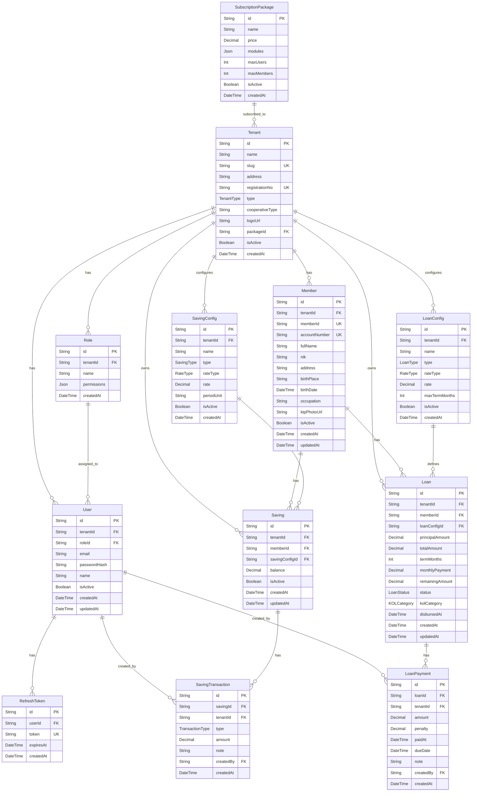

# Entity Relationship Document (ERD)
## SISKOP — Sistem Informasi Koperasi Berbasis SaaS

| | |
|---|---|
| **Versi** | 1.0.0 |
| **Tanggal** | Juni 2026 |
| **Database** | PostgreSQL |
| **ORM** | Prisma |

---

## 1. ERD Diagram (Mermaid)



---

## 2. Tabel Detail

### 2.1 SubscriptionPackage

| Kolom | Tipe | Constraint | Keterangan |
|-------|------|------------|------------|
| id | VARCHAR | PK, CUID | Primary key |
| name | VARCHAR(100) | NOT NULL | Nama paket (Basic, Pro, Enterprise) |
| price | DECIMAL(15,2) | NOT NULL | Harga per bulan |
| modules | JSONB | NOT NULL | Array module key yang diaktifkan |
| maxUsers | INTEGER | NOT NULL | Batas jumlah user per tenant |
| maxMembers | INTEGER | NOT NULL | Batas jumlah anggota per tenant |
| isActive | BOOLEAN | DEFAULT true | Status paket |
| createdAt | TIMESTAMP | DEFAULT NOW() | Waktu dibuat |

### 2.2 Tenant

| Kolom | Tipe | Constraint | Keterangan |
|-------|------|------------|------------|
| id | VARCHAR | PK, CUID | Primary key |
| name | VARCHAR(200) | NOT NULL | Nama koperasi |
| slug | VARCHAR(100) | UNIQUE, NOT NULL | Subdomain identifier |
| address | TEXT | NOT NULL | Alamat koperasi |
| registrationNo | VARCHAR(100) | UNIQUE, NOT NULL | No. pendaftaran resmi |
| type | ENUM | NOT NULL | SYARIAH \| KONVENSIONAL |
| cooperativeType | VARCHAR(100) | DEFAULT 'KSP' | Jenis koperasi |
| logoUrl | VARCHAR | NULLABLE | URL logo koperasi |
| packageId | VARCHAR | FK | Paket langganan aktif |
| isActive | BOOLEAN | DEFAULT true | Status koperasi |
| createdAt | TIMESTAMP | DEFAULT NOW() | Tanggal daftar |

**Index:** `slug` (UNIQUE), `registrationNo` (UNIQUE)

### 2.3 Role

| Kolom | Tipe | Constraint | Keterangan |
|-------|------|------------|------------|
| id | VARCHAR | PK, CUID | Primary key |
| tenantId | VARCHAR | FK, NOT NULL | Koperasi pemilik role |
| name | VARCHAR(100) | NOT NULL | Nama role |
| permissions | JSONB | NOT NULL | Matriks permission per modul |
| createdAt | TIMESTAMP | DEFAULT NOW() | Waktu dibuat |

**Struktur permissions JSONB:**
```json
{
  "dashboard": { "read": true },
  "members":   { "create": true, "read": true, "update": true, "delete": false },
  "savings":   { "create": true, "read": true, "update": true, "delete": false },
  "loans":     { "create": true, "read": true, "update": true, "delete": false },
  "reports":   { "read": true, "export": true },
  "config":    { "read": false, "update": false },
  "users":     { "create": false, "read": false, "update": false, "delete": false },
  "roles":     { "create": false, "read": false, "update": false, "delete": false }
}
```

### 2.4 User

| Kolom | Tipe | Constraint | Keterangan |
|-------|------|------------|------------|
| id | VARCHAR | PK, CUID | Primary key |
| tenantId | VARCHAR | FK, NOT NULL | Koperasi pemilik |
| roleId | VARCHAR | FK, NOT NULL | Role yang ditetapkan |
| email | VARCHAR(255) | NOT NULL | Email login |
| passwordHash | VARCHAR | NULLABLE | Null jika hanya SSO |
| name | VARCHAR(200) | NOT NULL | Nama lengkap user |
| isActive | BOOLEAN | DEFAULT true | Status user |
| createdAt | TIMESTAMP | DEFAULT NOW() | Waktu dibuat |
| updatedAt | TIMESTAMP | AUTO UPDATE | Waktu update terakhir |

**Unique Constraint:** `(tenantId, email)` — email unik per koperasi

### 2.5 RefreshToken

| Kolom | Tipe | Constraint | Keterangan |
|-------|------|------------|------------|
| id | VARCHAR | PK, CUID | Primary key |
| userId | VARCHAR | FK, NOT NULL | User pemilik token |
| token | VARCHAR | UNIQUE, NOT NULL | JWT refresh token hash |
| expiresAt | TIMESTAMP | NOT NULL | Waktu kadaluarsa |
| createdAt | TIMESTAMP | DEFAULT NOW() | Waktu dibuat |

### 2.6 Member

| Kolom | Tipe | Constraint | Keterangan |
|-------|------|------------|------------|
| id | VARCHAR | PK, CUID | Primary key |
| tenantId | VARCHAR | FK, NOT NULL | Koperasi pemilik |
| memberId | VARCHAR(50) | UNIQUE, NOT NULL | Auto-generated ID anggota |
| accountNumber | VARCHAR(20) | UNIQUE, NOT NULL | Auto-generated no. rekening |
| fullName | VARCHAR(200) | NOT NULL | Nama lengkap |
| nik | VARCHAR(16) | NOT NULL | Nomor Induk Kependudukan |
| address | TEXT | NOT NULL | Alamat lengkap |
| birthPlace | VARCHAR(100) | NOT NULL | Kota tempat lahir |
| birthDate | DATE | NOT NULL | Tanggal lahir |
| occupation | VARCHAR(200) | NOT NULL | Pekerjaan |
| ktpPhotoUrl | VARCHAR | NULLABLE | Path foto KTP |
| isActive | BOOLEAN | DEFAULT true | Status anggota |
| createdAt | TIMESTAMP | DEFAULT NOW() | Tanggal daftar |
| updatedAt | TIMESTAMP | AUTO UPDATE | Update terakhir |

**Unique Constraint:** `(tenantId, nik)` — NIK unik per koperasi

**Index:** `tenantId`, `memberId`, `accountNumber`, `fullName` (untuk search)

### 2.7 SavingConfig

| Kolom | Tipe | Constraint | Keterangan |
|-------|------|------------|------------|
| id | VARCHAR | PK, CUID | Primary key |
| tenantId | VARCHAR | FK, NOT NULL | Koperasi pemilik |
| name | VARCHAR(100) | NOT NULL | Nama jenis simpanan |
| type | ENUM | NOT NULL | POKOK \| WAJIB \| SUKARELA |
| rateType | ENUM | NOT NULL | BUNGA \| BAGI_HASIL |
| rate | DECIMAL(8,4) | NOT NULL | Persentase rate |
| periodUnit | VARCHAR(10) | NOT NULL | MONTHLY \| YEARLY |
| isActive | BOOLEAN | DEFAULT true | Status konfigurasi |
| createdAt | TIMESTAMP | DEFAULT NOW() | Waktu dibuat |

### 2.8 Saving

| Kolom | Tipe | Constraint | Keterangan |
|-------|------|------------|------------|
| id | VARCHAR | PK, CUID | Primary key |
| tenantId | VARCHAR | FK, NOT NULL | Koperasi pemilik |
| memberId | VARCHAR | FK, NOT NULL | Anggota pemilik |
| savingConfigId | VARCHAR | FK, NOT NULL | Jenis simpanan |
| balance | DECIMAL(15,2) | DEFAULT 0 | Saldo saat ini |
| isActive | BOOLEAN | DEFAULT true | Status rekening simpanan |
| createdAt | TIMESTAMP | DEFAULT NOW() | Tanggal buka rekening |
| updatedAt | TIMESTAMP | AUTO UPDATE | Update terakhir |

### 2.9 SavingTransaction

| Kolom | Tipe | Constraint | Keterangan |
|-------|------|------------|------------|
| id | VARCHAR | PK, CUID | Primary key |
| savingId | VARCHAR | FK, NOT NULL | Rekening simpanan |
| tenantId | VARCHAR | FK, NOT NULL | Koperasi |
| type | ENUM | NOT NULL | DEPOSIT \| WITHDRAWAL |
| amount | DECIMAL(15,2) | NOT NULL | Nominal transaksi |
| note | TEXT | NULLABLE | Catatan transaksi |
| createdBy | VARCHAR | FK, NOT NULL | User yang input |
| createdAt | TIMESTAMP | DEFAULT NOW() | Waktu transaksi |

**Index:** `savingId`, `tenantId`, `createdAt`

### 2.10 LoanConfig

| Kolom | Tipe | Constraint | Keterangan |
|-------|------|------------|------------|
| id | VARCHAR | PK, CUID | Primary key |
| tenantId | VARCHAR | FK, NOT NULL | Koperasi pemilik |
| name | VARCHAR(100) | NOT NULL | Nama jenis pembiayaan |
| type | ENUM | NOT NULL | SYARIAH \| KONVENSIONAL |
| rateType | ENUM | NOT NULL | BUNGA \| MARGIN \| BAGI_HASIL |
| rate | DECIMAL(8,4) | NOT NULL | Rate per tahun |
| maxTermMonths | INTEGER | NOT NULL | Tenor maksimal (bulan) |
| isActive | BOOLEAN | DEFAULT true | Status konfigurasi |
| createdAt | TIMESTAMP | DEFAULT NOW() | Waktu dibuat |

### 2.11 Loan

| Kolom | Tipe | Constraint | Keterangan |
|-------|------|------------|------------|
| id | VARCHAR | PK, CUID | Primary key |
| tenantId | VARCHAR | FK, NOT NULL | Koperasi pemilik |
| memberId | VARCHAR | FK, NOT NULL | Anggota peminjam |
| loanConfigId | VARCHAR | FK, NOT NULL | Jenis pembiayaan |
| principalAmount | DECIMAL(15,2) | NOT NULL | Nominal pokok pinjaman |
| totalAmount | DECIMAL(15,2) | NOT NULL | Total (pokok + bunga/margin) |
| termMonths | INTEGER | NOT NULL | Tenor dalam bulan |
| monthlyPayment | DECIMAL(15,2) | NOT NULL | Angsuran per bulan |
| remainingAmount | DECIMAL(15,2) | NOT NULL | Sisa yang belum dibayar |
| status | ENUM | DEFAULT ACTIVE | PENDING \| ACTIVE \| COMPLETED \| DEFAULTED |
| kolCategory | ENUM | DEFAULT LANCAR | LANCAR \| DALAM_PERHATIAN \| KURANG_LANCAR \| DIRAGUKAN \| MACET |
| disbursedAt | TIMESTAMP | NULLABLE | Tanggal pencairan |
| createdAt | TIMESTAMP | DEFAULT NOW() | Tanggal pengajuan |
| updatedAt | TIMESTAMP | AUTO UPDATE | Update terakhir |

**Index:** `tenantId`, `memberId`, `status`, `kolCategory`

### 2.12 LoanPayment

| Kolom | Tipe | Constraint | Keterangan |
|-------|------|------------|------------|
| id | VARCHAR | PK, CUID | Primary key |
| loanId | VARCHAR | FK, NOT NULL | Pinjaman terkait |
| tenantId | VARCHAR | FK, NOT NULL | Koperasi |
| amount | DECIMAL(15,2) | NOT NULL | Nominal bayar |
| penalty | DECIMAL(15,2) | DEFAULT 0 | Denda keterlambatan |
| paidAt | TIMESTAMP | NOT NULL | Tanggal bayar aktual |
| dueDate | TIMESTAMP | NOT NULL | Tanggal jatuh tempo cicilan ini |
| note | TEXT | NULLABLE | Catatan |
| createdBy | VARCHAR | FK, NOT NULL | User yang input |
| createdAt | TIMESTAMP | DEFAULT NOW() | Waktu input |

**Index:** `loanId`, `tenantId`, `dueDate`, `paidAt`

---

## 3. Enums

```sql
-- Jenis koperasi
CREATE TYPE "TenantType"    AS ENUM ('SYARIAH', 'KONVENSIONAL');

-- Jenis simpanan
CREATE TYPE "SavingType"    AS ENUM ('POKOK', 'WAJIB', 'SUKARELA');

-- Jenis rate
CREATE TYPE "RateType"      AS ENUM ('BUNGA', 'BAGI_HASIL', 'MARGIN');

-- Tipe transaksi simpanan
CREATE TYPE "TransactionType" AS ENUM ('DEPOSIT', 'WITHDRAWAL');

-- Tipe pinjaman
CREATE TYPE "LoanType"      AS ENUM ('SYARIAH', 'KONVENSIONAL');

-- Status pinjaman
CREATE TYPE "LoanStatus"    AS ENUM ('PENDING', 'ACTIVE', 'COMPLETED', 'DEFAULTED');

-- Kategori kualitas pinjaman
CREATE TYPE "KOLCategory"   AS ENUM (
  'LANCAR',
  'DALAM_PERHATIAN',
  'KURANG_LANCAR',
  'DIRAGUKAN',
  'MACET'
);
```

---

## 4. Prisma Schema Lengkap

```prisma
// prisma/schema.prisma

generator client {
  provider = "prisma-client-js"
}

datasource db {
  provider = "postgresql"
  url      = env("DATABASE_URL")
}

// ── ENUMS ──────────────────────────────────────────────────

enum TenantType      { SYARIAH KONVENSIONAL }
enum SavingType      { POKOK WAJIB SUKARELA }
enum RateType        { BUNGA BAGI_HASIL MARGIN }
enum TransactionType { DEPOSIT WITHDRAWAL }
enum LoanType        { SYARIAH KONVENSIONAL }
enum LoanStatus      { PENDING ACTIVE COMPLETED DEFAULTED }
enum KOLCategory     { LANCAR DALAM_PERHATIAN KURANG_LANCAR DIRAGUKAN MACET }

// ── PLATFORM ────────────────────────────────────────────────

model SubscriptionPackage {
  id         String   @id @default(cuid())
  name       String
  price      Decimal  @db.Decimal(15, 2)
  modules    String[]
  maxUsers   Int
  maxMembers Int
  isActive   Boolean  @default(true)
  createdAt  DateTime @default(now())
  tenants    Tenant[]
}

model Tenant {
  id             String              @id @default(cuid())
  name           String
  slug           String              @unique
  address        String
  registrationNo String              @unique
  type           TenantType
  cooperativeType String             @default("KSP")
  logoUrl        String?
  packageId      String?
  package        SubscriptionPackage? @relation(fields: [packageId], references: [id])
  isActive       Boolean             @default(true)
  createdAt      DateTime            @default(now())

  users          User[]
  roles          Role[]
  members        Member[]
  savingConfigs  SavingConfig[]
  loanConfigs    LoanConfig[]
  savings        Saving[]
  loans          Loan[]
  savingTxns     SavingTransaction[]
  loanPayments   LoanPayment[]
}

// ── AUTH ────────────────────────────────────────────────────

model Role {
  id          String   @id @default(cuid())
  tenantId    String
  tenant      Tenant   @relation(fields: [tenantId], references: [id])
  name        String
  permissions Json
  createdAt   DateTime @default(now())
  users       User[]
}

model User {
  id           String   @id @default(cuid())
  tenantId     String
  tenant       Tenant   @relation(fields: [tenantId], references: [id])
  roleId       String
  role         Role     @relation(fields: [roleId], references: [id])
  email        String
  passwordHash String?
  name         String
  isActive     Boolean  @default(true)
  createdAt    DateTime @default(now())
  updatedAt    DateTime @updatedAt

  refreshTokens      RefreshToken[]
  savingTransactions SavingTransaction[]
  loanPayments       LoanPayment[]

  @@unique([tenantId, email])
}

model RefreshToken {
  id        String   @id @default(cuid())
  userId    String
  user      User     @relation(fields: [userId], references: [id])
  token     String   @unique
  expiresAt DateTime
  createdAt DateTime @default(now())
}

// ── MEMBER ──────────────────────────────────────────────────

model Member {
  id            String   @id @default(cuid())
  tenantId      String
  tenant        Tenant   @relation(fields: [tenantId], references: [id])
  memberId      String   @unique
  accountNumber String   @unique
  fullName      String
  nik           String
  address       String
  birthPlace    String
  birthDate     DateTime
  occupation    String
  ktpPhotoUrl   String?
  isActive      Boolean  @default(true)
  createdAt     DateTime @default(now())
  updatedAt     DateTime @updatedAt

  savings Saving[]
  loans   Loan[]

  @@unique([tenantId, nik])
  @@index([tenantId])
  @@index([fullName])
}

// ── SAVINGS ─────────────────────────────────────────────────

model SavingConfig {
  id         String     @id @default(cuid())
  tenantId   String
  tenant     Tenant     @relation(fields: [tenantId], references: [id])
  name       String
  type       SavingType
  rateType   RateType
  rate       Decimal    @db.Decimal(8, 4)
  periodUnit String
  isActive   Boolean    @default(true)
  createdAt  DateTime   @default(now())
  savings    Saving[]
}

model Saving {
  id             String       @id @default(cuid())
  tenantId       String
  tenant         Tenant       @relation(fields: [tenantId], references: [id])
  memberId       String
  member         Member       @relation(fields: [memberId], references: [id])
  savingConfigId String
  savingConfig   SavingConfig @relation(fields: [savingConfigId], references: [id])
  balance        Decimal      @default(0) @db.Decimal(15, 2)
  isActive       Boolean      @default(true)
  createdAt      DateTime     @default(now())
  updatedAt      DateTime     @updatedAt

  transactions SavingTransaction[]

  @@index([tenantId])
  @@index([memberId])
}

model SavingTransaction {
  id        String          @id @default(cuid())
  savingId  String
  saving    Saving          @relation(fields: [savingId], references: [id])
  tenantId  String
  tenant    Tenant          @relation(fields: [tenantId], references: [id])
  type      TransactionType
  amount    Decimal         @db.Decimal(15, 2)
  note      String?
  createdBy String
  createdByUser User        @relation(fields: [createdBy], references: [id])
  createdAt DateTime        @default(now())

  @@index([savingId])
  @@index([tenantId])
  @@index([createdAt])
}

// ── LOANS ───────────────────────────────────────────────────

model LoanConfig {
  id            String   @id @default(cuid())
  tenantId      String
  tenant        Tenant   @relation(fields: [tenantId], references: [id])
  name          String
  type          LoanType
  rateType      RateType
  rate          Decimal  @db.Decimal(8, 4)
  maxTermMonths Int
  isActive      Boolean  @default(true)
  createdAt     DateTime @default(now())
  loans         Loan[]
}

model Loan {
  id              String      @id @default(cuid())
  tenantId        String
  tenant          Tenant      @relation(fields: [tenantId], references: [id])
  memberId        String
  member          Member      @relation(fields: [memberId], references: [id])
  loanConfigId    String
  loanConfig      LoanConfig  @relation(fields: [loanConfigId], references: [id])
  principalAmount Decimal     @db.Decimal(15, 2)
  totalAmount     Decimal     @db.Decimal(15, 2)
  termMonths      Int
  monthlyPayment  Decimal     @db.Decimal(15, 2)
  remainingAmount Decimal     @db.Decimal(15, 2)
  status          LoanStatus  @default(ACTIVE)
  kolCategory     KOLCategory @default(LANCAR)
  disbursedAt     DateTime?
  createdAt       DateTime    @default(now())
  updatedAt       DateTime    @updatedAt

  payments LoanPayment[]

  @@index([tenantId])
  @@index([memberId])
  @@index([status])
  @@index([kolCategory])
}

model LoanPayment {
  id        String   @id @default(cuid())
  loanId    String
  loan      Loan     @relation(fields: [loanId], references: [id])
  tenantId  String
  tenant    Tenant   @relation(fields: [tenantId], references: [id])
  amount    Decimal  @db.Decimal(15, 2)
  penalty   Decimal  @default(0) @db.Decimal(15, 2)
  paidAt    DateTime
  dueDate   DateTime
  note      String?
  createdBy String
  createdByUser User @relation(fields: [createdBy], references: [id])
  createdAt DateTime @default(now())

  @@index([loanId])
  @@index([tenantId])
  @@index([dueDate])
}
```

---

## 5. Tenant Isolation Strategy

Setiap query ke tabel tenant-scoped **WAJIB** menyertakan `tenantId` filter:

```typescript
// BENAR ✅
await prisma.member.findMany({
  where: { tenantId: req.tenant.id, isActive: true }
});

// SALAH ❌ — tidak aman, bisa expose data lintas tenant
await prisma.member.findMany({
  where: { fullName: { contains: search } }
});
```

Kolom `tenantId` ada di semua tabel data (bukan hanya FK ke Tenant, tapi juga index) untuk memastikan query performance pada skala besar.
