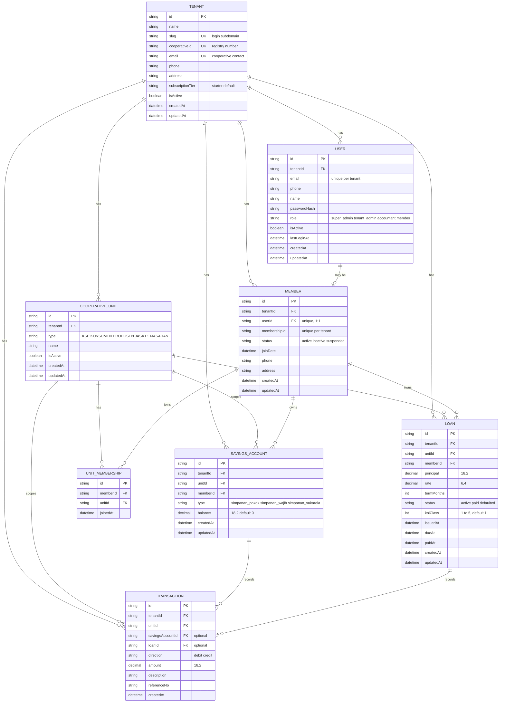

# 03 — Entity-Relationship Diagram: SISKOP

Status: generated directly from `apps/backend/prisma/schema.prisma` as of migration
`20260727093000_add_tenant_slug`. This is the actual, currently-migrated schema — not a target
design. Fills the `03-ERD-SISKOP.md` gap noted in `SETUP-VERIFICATION.md` "Known gaps".

## 1. Diagram

## 2. Reading the diagram

- **`TENANT`** is the root of every relationship. Every other table carries a `tenantId` foreign
  key, including `TRANSACTION`, which also carries `unitId` — both denormalized alongside their
  "real" parent (`SAVINGS_ACCOUNT`/`LOAN`) specifically so the tenant-isolation filter never
  depends on a join being written correctly (see the comment on `Transaction` in
  `prisma/schema.prisma`).
- **`COOPERATIVE_UNIT`** is the "business line" a tenant runs (KSP, Konsumen, Produsen, Jasa,
  Pemasaran). A tenant with 2+ active units is a koperasi serba usaha (KSU) — that is a computed
  property (`isMultiUnit()`), not a row or column anywhere in this diagram.
- **`USER` ↔ `MEMBER`** is optional 1:1, not 1:1 mandatory: every `Member` has exactly one `User`
  (`Member.userId` is unique and required), but not every `User` has a `Member` row — staff-only
  accounts (`tenant_admin`, `accountant`, `super_admin`) authenticate without being a cooperative
  member.
- **`MEMBER` ↔ `COOPERATIVE_UNIT`** is many-to-many through `UNIT_MEMBERSHIP`. A member's
  koperasi-level identity (`Member`) is separate from which units they actually participate in;
  SHU distribution and per-unit access are computed against `UNIT_MEMBERSHIP`, not `MEMBER` alone.
- **`SAVINGS_ACCOUNT`** is unique per `(unitId, memberId, type)` — one account per savings type,
  per unit, per member. A member with accounts in two units (or two savings types) has two rows.
- **`TRANSACTION`** links to *at most one* of `SAVINGS_ACCOUNT` or `LOAN` (both foreign keys are
  optional) — it is a single ledger table for both savings movements and loan movements, plus room
  for entries tied to neither (e.g. a standalone fee), though nothing in the codebase writes such
  a row yet.

## 3. Cardinality summary

| Relationship | Cardinality | Enforced by |
|---|---|---|
| Tenant → CooperativeUnit | 1 → 0..N (app guarantees ≥1) | FK + `provisionTenant()` transaction |
| Tenant → User | 1 → 0..N | FK |
| Tenant → Member | 1 → 0..N | FK |
| CooperativeUnit → UnitMembership | 1 → 0..N | FK |
| Member → UnitMembership | 1 → 0..N | FK |
| Member ↔ CooperativeUnit (via UnitMembership) | N ↔ N | `@@unique([memberId, unitId])` prevents duplicate joins |
| User → Member | 1 → 0..1 | `Member.userId` unique FK |
| Member → SavingsAccount | 1 → 0..N | FK; `@@unique([unitId, memberId, type])` caps it at one row per type per unit |
| Member → Loan | 1 → 0..N | FK |
| SavingsAccount → Transaction | 1 → 0..N | Optional FK on `Transaction.savingsAccountId` |
| Loan → Transaction | 1 → 0..N | Optional FK on `Transaction.loanId` |

## 4. Not yet in the schema

These entities are implied by the product scope (`docs/01-PRD-SISKOP.md` §5) but do not exist as
Prisma models yet. Listed here so this ERD isn't mistaken for a complete target design:

- **RepaymentSchedule / Installment** — loan repayment is currently a single `Loan` row with no
  per-installment breakdown.
- **ShuDistribution** — SHU (sisa hasil usaha) calculation and per-member distribution has no
  storage.
- **TenantConfig / Settings** — no model backs the planned Config module.
- **AuditLog** — no change-history table exists; `updatedAt` timestamps are the only trace of a
  mutation.
- **PlatformAdmin-scoped entities** — nothing cross-tenant exists for the `super_admin` role
  beyond the enum value itself.

## 5. Related documents

- `docs/05-DB-Schema-SISKOP.md` — column-level schema reference, indexes, migration history
- `docs/04-System-Architecture-SISKOP.md` §6 — how tenant isolation is enforced at the query layer
- `apps/backend/prisma/schema.prisma` — source of truth; regenerate this diagram if it changes
