# 03 — Entity-Relationship Diagram: SISKOP

Status: generated directly from `apps/backend/prisma/schema.prisma` as of migration
`20260728050338_add_tenant_cascade_deletes`, **2026-07-29**. This is the actual, currently-migrated
schema — not a target design. Supersedes the 2026-07-27 version of this document, which diagrammed
the original 8-model scaffold before the pre-rescaffold KSP product (Members/Savings/Loans/
Accounting) and the Phase 2 SaaS-packaging models (SubscriptionPackage/WhitelabelConfig) were
merged in.

Entity attribute blocks below list identifying/key columns only (PK, FK, and the columns that
distinguish one row's meaning from another) — see `docs/05-DB-Schema-SISKOP.md` for the full,
column-by-column reference each entity's complete attribute list lives in.

## 1. Diagram

```mermaid
erDiagram
    SUBSCRIPTION_PACKAGE ||--o{ TENANT : "entitles (optional)"
    TENANT ||--o{ COOPERATIVE_UNIT : "has"
    TENANT ||--o{ ROLE : "has"
    TENANT ||--o{ USER : "has"
    TENANT ||--o{ MEMBER : "has"
    TENANT ||--o{ SAVING_CONFIG : "has"
    TENANT ||--o{ LOAN_CONFIG : "has"
    TENANT ||--o{ SAVING : "has"
    TENANT ||--o{ LOAN : "has"
    TENANT ||--o| WHITELABEL_CONFIG : "has"
    TENANT ||--o{ ACCOUNT : "has"
    TENANT ||--o{ ACCOUNT_MAPPING : "has"
    TENANT ||--o{ JOURNAL_ENTRY : "has"
    TENANT ||--o| SHU_DISTRIBUTION_CONFIG : "has"
    TENANT ||--o{ CALK_NARRATIVE : "has"
    TENANT ||--o{ NOTIFICATION : "related to (optional)"

    ROLE ||--o{ USER : "grants access via"

    COOPERATIVE_UNIT ||--o{ UNIT_MEMBERSHIP : "has"
    COOPERATIVE_UNIT ||--o{ SAVING : "scopes"
    COOPERATIVE_UNIT ||--o{ LOAN : "scopes"

    MEMBER ||--o{ UNIT_MEMBERSHIP : "joins"
    MEMBER ||--o{ SAVING : "owns"
    MEMBER ||--o{ LOAN : "owns"

    SAVING_CONFIG ||--o{ SAVING : "instantiated as"
    LOAN_CONFIG ||--o{ LOAN : "instantiated as"

    SAVING ||--o{ SAVING_TRANSACTION : "records"
    LOAN ||--o{ LOAN_PAYMENT : "records"
    USER ||--o{ SAVING_TRANSACTION : "recorded by"
    USER ||--o{ LOAN_PAYMENT : "recorded by"
    USER ||--o{ NOTIFICATION_READ : "reads"
    NOTIFICATION ||--o{ NOTIFICATION_READ : "read by"

    ACCOUNT ||--o{ ACCOUNT : "parent/child (self)"
    ACCOUNT ||--o{ ACCOUNT_MAPPING : "debit/credit target"
    ACCOUNT ||--o{ JOURNAL_LINE : "posted to"
    JOURNAL_ENTRY ||--o{ JOURNAL_LINE : "has"

    SUBSCRIPTION_PACKAGE {
        string id PK
        string name
        decimal price "15,2"
        string_array modules "e.g. accounting"
        boolean whitelabelEnabled
        boolean isActive
    }

    TENANT {
        string id PK
        string name
        string slug UK "login subdomain"
        string registrationNo UK "registry number"
        enum type "SYARIAH KONVENSIONAL"
        string packageId FK "nullable"
        boolean isActive
        decimal modalDisetor "15,2 nullable"
    }

    COOPERATIVE_UNIT {
        string id PK
        string tenantId FK
        string type "KSP KONSUMEN PRODUSEN JASA PEMASARAN"
        boolean isActive
    }

    ROLE {
        string id PK
        string tenantId FK
        string name "Super Admin Manager Teller Viewer"
        json permissions
    }

    USER {
        string id PK
        string tenantId FK
        string roleId FK
        string email "unique per tenant"
        boolean isPlatformAdmin
    }

    MEMBER {
        string id PK
        string tenantId FK
        string memberId UK "global"
        string accountNumber UK "global"
        string nik "unique per tenant"
        boolean isActive
    }

    UNIT_MEMBERSHIP {
        string id PK
        string memberId FK
        string unitId FK
    }

    SAVING_CONFIG {
        string id PK
        string tenantId FK
        enum type "POKOK WAJIB SUKARELA"
        boolean isDefault
    }

    SAVING {
        string id PK
        string tenantId FK
        string unitId FK
        string memberId FK
        string savingConfigId FK
        decimal balance "15,2"
    }

    SAVING_TRANSACTION {
        string id PK
        string savingId FK
        string tenantId FK
        enum type "DEPOSIT WITHDRAWAL"
        decimal amount "15,2"
        string createdBy FK
    }

    LOAN_CONFIG {
        string id PK
        string tenantId FK
        enum type "SYARIAH KONVENSIONAL"
    }

    LOAN {
        string id PK
        string tenantId FK
        string unitId FK
        string memberId FK
        string loanConfigId FK
        enum status "PENDING ACTIVE COMPLETED DEFAULTED"
        enum kolCategory "LANCAR..MACET"
    }

    LOAN_PAYMENT {
        string id PK
        string loanId FK
        string tenantId FK
        decimal amount "15,2"
        string createdBy FK
    }

    ACCOUNT {
        string id PK
        string tenantId FK
        string code "unique per tenant"
        string parentId FK "self, nullable"
        enum category "ASET KEWAJIBAN EKUITAS PENDAPATAN BEBAN"
        boolean isActive
    }

    ACCOUNT_MAPPING {
        string id PK
        string tenantId FK
        enum sourceType "SAVING_CONFIG LOAN_CONFIG SYSTEM"
        string debitAccountId FK
        string creditAccountId FK
    }

    JOURNAL_ENTRY {
        string id PK
        string tenantId FK
        enum sourceType "SAVING_TRANSACTION LOAN_PAYMENT LOAN_DISBURSEMENT MANUAL"
        enum status "POSTED UNPOSTED_MISSING_MAPPING"
    }

    JOURNAL_LINE {
        string id PK
        string journalEntryId FK
        string accountId FK
        decimal debit "15,2"
        decimal credit "15,2"
    }

    WHITELABEL_CONFIG {
        string id PK
        string tenantId FK "unique, 1:1"
        string customDomain UK "global, nullable"
        enum domainStatus "PENDING VERIFIED FAILED"
    }

    SHU_DISTRIBUTION_CONFIG {
        string id PK
        string tenantId FK "unique, 1:1"
        decimal jasaSimpananPercent "5,2"
        decimal jasaPinjamanPercent "5,2"
        decimal cadanganPercent "5,2"
        decimal lainnyaPercent "5,2"
    }

    CALK_NARRATIVE {
        string id PK
        string tenantId FK
        enum section "UMUM DASAR_PENYUSUNAN KEBIJAKAN_AKUNTANSI INFORMASI_TAMBAHAN"
    }

    NOTIFICATION {
        string id PK
        enum type "TENANT_REGISTERED BILLING_BLOCKED PACKAGE_CHANGED AUDIT_THRESHOLD_EXCEEDED"
        string relatedTenantId FK "nullable"
    }

    NOTIFICATION_READ {
        string id PK
        string notificationId FK
        string userId FK
    }
```

## 2. Reading the diagram

- **`TENANT`** is still the root of nearly every relationship, same as the original scaffold — but
  no longer carries an `email`/`phone` column (removed in the merge; a divergence from the
  2026-07-27 version of this document). Money-bearing tables (`Saving`, `Loan`, `LoanPayment`,
  `JournalLine`, etc.) all carry a direct `tenantId`, denormalized alongside their "real" parent so
  the tenant-isolation filter never depends on a join being written correctly.
- **`SUBSCRIPTION_PACKAGE ↔ TENANT`** is optional 1-to-many: a package can be assigned to many
  tenants, a tenant has at most one package (`packageId` nullable). `null` means the tenant gets no
  add-on modules — not "everything unlocked." Self-service `registerTenant()` still leaves this
  `null`; only a platform admin assigning one via `PUT /platform/tenants/:id` changes it.
- **`ROLE ↔ USER`** replaces the scaffold's single `User.role` string column. `Role.permissions`
  (JSON) is the fine-grained axis checked by `requirePermission(module, action)`; a separate,
  *computed* `AuthClaims.role` (coarse: `super_admin`/`tenant_admin`/`accountant`/`member`) rides in
  the JWT for platform-admin gating and is never itself stored as a column.
- **`MEMBER` has no `User` relationship at all** — a deliberate divergence from the original
  scaffold's mandatory 1:1 `Member ↔ User`. Members don't log in in this product; only staff
  (`User` rows, via a `Role`) authenticate.
- **`SAVING_CONFIG`/`LOAN_CONFIG` vs. `SAVING`/`LOAN`** is a product-vs-instance split that didn't
  exist in the original scaffold (which had one flat `SavingsAccount`/`Loan` table each): a
  `SavingConfig`/`LoanConfig` is a product the tenant offers (rate, term, type); a `Saving`/`Loan`
  is one member's actual instance of that product, and `SavingTransaction`/`LoanPayment` are the
  append-only ledgers against each instance.
- **`ACCOUNT` is self-referencing** (`parentId` → `Account.id`) for a header/child Chart-of-Accounts
  hierarchy — not present in the original scaffold at all. `ACCOUNT_MAPPING` routes a transaction
  kind (deposit, disbursement, payment principal, …) to a debit/credit `Account` pair;
  `JOURNAL_ENTRY`/`JOURNAL_LINE` is the resulting double-entry postings, generated automatically
  by `lib/journal.ts` whenever Savings/Loans code writes a `SavingTransaction`/`LoanPayment`.
- **`WHITELABEL_CONFIG`** and **`SHU_DISTRIBUTION_CONFIG`** are both strict 1:1 with `TENANT`
  (`tenantId` is `@unique` on each) — every tenant has at most one row, created via upsert on
  first save rather than at provisioning time.

## 3. Cardinality summary

| Relationship | Cardinality | Enforced by |
|---|---|---|
| SubscriptionPackage → Tenant | 0..1 → 0..N | Optional FK (`Tenant.packageId`) |
| Tenant → CooperativeUnit | 1 → 0..N (app guarantees ≥1) | FK + `provisionTenantInTx()` transaction |
| Tenant → Role | 1 → 0..N (4 seeded at provisioning) | FK |
| Tenant → User | 1 → 0..N | FK |
| Role → User | 1 → 0..N | FK (`User.roleId` required) |
| Tenant → Member | 1 → 0..N | FK |
| Member → UnitMembership | 1 → 0..N | FK |
| Member ↔ CooperativeUnit (via UnitMembership) | N ↔ N | `@@unique([memberId, unitId])` |
| SavingConfig → Saving | 1 → 0..N | FK |
| Member → Saving | 1 → 0..N | FK |
| Saving → SavingTransaction | 1 → 0..N | FK |
| LoanConfig → Loan | 1 → 0..N | FK |
| Member → Loan | 1 → 0..N | FK |
| Loan → LoanPayment | 1 → 0..N | FK |
| Account → Account (self, parent/child) | 0..1 → 0..N | FK (`parentId`, nullable) |
| Account → AccountMapping | 1 → 0..N (as debit or credit target) | FK, two separate relations |
| Tenant → AccountMapping | 1 → 0..N | `@@unique([tenantId, sourceType, sourceId, transactionKind])` — one mapping per key |
| JournalEntry → JournalLine | 1 → 0..N | FK, `onDelete: Cascade` |
| Account → JournalLine | 1 → 0..N | FK |
| Tenant → WhitelabelConfig | 1 → 0..1 | `@@unique(tenantId)` |
| Tenant → ShuDistributionConfig | 1 → 0..1 | `@@unique(tenantId)` |
| Notification → NotificationRead | 1 → 0..N | FK, `onDelete: Cascade` |
| User → NotificationRead | 1 → 0..N | FK, `onDelete: Cascade` |

## 4. Not yet in the schema

Listed here so this ERD isn't mistaken for a complete target design:

- **`RefreshToken`** — the pre-rescaffold backup this product was merged from had a DB-backed,
  revocable refresh token. This codebase's refresh token is a stateless signed JWT instead — a
  considered trade-off (see `docs/04-System-Architecture-SISKOP.md` §6), not a gap to fill by
  default.
- **Quota enforcement columns** — `SubscriptionPackage.maxUsers`/`maxMembers`/`maxSavingConfigs`
  exist but nothing reads them yet; only `modules` (via `requireAccountingEntitlement`) and
  `whitelabelEnabled` (via `requireWhitelabelEntitlement`) are actually enforced.
- **Billing automation** — `Tenant.nextBillingDate`/`billingReminder30SentAt`/
  `billingReminder7SentAt` and `Notification.type = BILLING_BLOCKED`/`PACKAGE_CHANGED` exist as
  columns/enum values with no scheduler or job writing/reading them.
- **AuditLog** — no change-history table exists; `updatedAt` timestamps are the only trace of a
  mutation.

## 5. Related documents

- `docs/05-DB-Schema-SISKOP.md` — column-level schema reference, indexes, migration history
- `docs/04-System-Architecture-SISKOP.md` §5–6 — how tenant isolation and entitlement gating are
  enforced at the query layer
- `apps/backend/prisma/schema.prisma` — source of truth; regenerate this diagram if it changes
