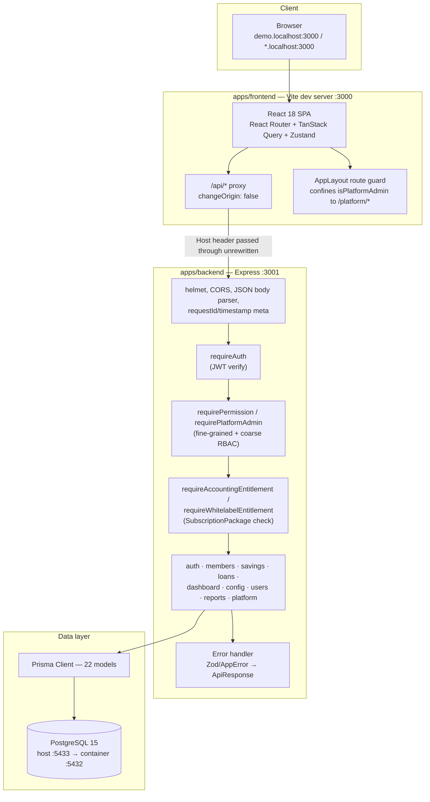
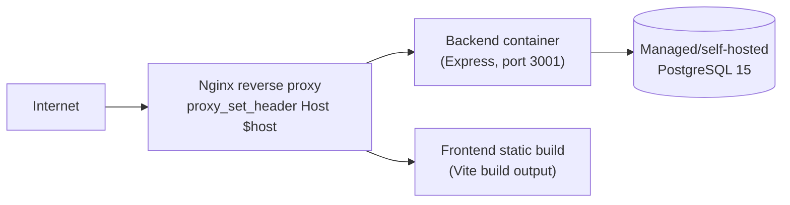

# 04 — System Architecture: SISKOP

Status: updated **2026-07-29** against the current codebase. Sections are marked **Current** (what
runs today) or **Target** (documented direction, not yet built). Supersedes the 2026-07-28 version
of this document, which described a backend with only `auth`/`tenants` modules wired — nine more
modules have shipped since (Members, Savings, Loans, Dashboard, Config, Users, Reports, Platform,
plus a cross-cutting entitlement layer).

## 1. High-level overview (Current)



Both apps run from one monorepo via Turborepo + pnpm workspaces (`pnpm run dev` runs both
concurrently: backend on `3001`, frontend on `3000`). `Ent` (entitlement) only sits in the request
path for the specific routes that need it (Chart of Accounts, Account Mappings, SHU config,
Whitelabel writes, and every `/reports/regulatory/*` route) — most routes go straight from `RBAC`
to `Routes`.

## 2. Monorepo layout (Current)

| Path | Contents |
|---|---|
| `apps/backend` | Express API, Prisma schema + 2 migrations, Vitest tests (16 files, 209 tests) |
| `apps/frontend` | React + Vite + Tailwind SPA — shadcn/ui component kit, 9 page directories |
| `packages/types` | `@siskop/types` — shared `ApiResponse`/`ErrorCode`, and one file per domain area (`tenant`, `unit`, `user`, `role`, `member`, `savings`, `loan`, `accounting`, `reports`, `dashboard`, `platform`), consumed by both apps so a wire-format change is a single-package edit |
| `packages/eslint-config` | Shared ESLint flat config |
| `docs/claude-integration` | Per-role (PM/Engineer/QA/Ops) Claude instructions |
| `docs/` | This document set |

Build orchestration is Turborepo (`turbo.json`): `build`/`typecheck`/`test` depend on `^build`
(`@siskop/types` builds before either app); `dev` is non-cached/persistent; `lint` has no outputs to
cache against. Running `pnpm --filter @siskop/backend test` directly (bypassing `turbo run test`)
skips that dependency ordering — if `@siskop/types` source changed but its `dist/` wasn't rebuilt
first, a concurrent `pnpm run typecheck` racing the same test run can produce spurious failures
(observed 2026-07-29; not a bug in the tests, a build-ordering hazard of invoking the filtered
script directly instead of through `turbo`).

`packages/shared`, named in the original scaffolding plan's file-structure diagram, was never
created and nothing imports it — still deliberately deferred.

## 3. Backend architecture (Current)

### 3.1 Module layout

```
apps/backend/src/
  app.ts                    # createApp(): middleware, route mounting, error handler
  main.ts                   # process entrypoint (listen)
  lib/
    db.ts                   # Prisma client singleton
    errors.ts               # AppError + ErrorCode → HTTP status map
    http.ts                 # requireParam() and other route helpers
    user-mapper.ts           # deriveUserRole(), toPublicUser()
    units.ts                # server-side unit resolution (never client-supplied)
    journal.ts              # double-entry posting engine
    kol.ts                  # KOL (kolektibilitas) reclassification
    loan-calc.ts            # amortization / margin calculation
    id-generator.ts
  middleware/
    auth.ts                 # requireAuth, signAccessToken/verifyAccessToken, assertUnitAccess
    rbac.ts                 # requirePermission(module, action), requirePlatformAdmin
    entitlement.ts           # requireAccountingEntitlement, requireWhitelabelEntitlement
  modules/
    auth/                   # register, login, refresh, /me, self-service profile/password
    tenants/
      provision.ts           # provisionTenantInTx() — shared by self-service and platform-admin creation
    members/                 # CRUD + KTP upload
    savings/                 # configs (products) + accounts + deposit/withdraw
    loans/                   # configs (products) + issuance + repayment + KOL
    dashboard/                # tenant summary
    config/                  # units, roles, users(*), accounts, account-mappings, shu-distribution, whitelabel, modal-disetor
    users/                   # tenant-scoped staff CRUD (distinct from config/service.ts's user listing — see note below)
    reports/                  # financial/RAT + full regulatory suite + PDF export
    platform/                 # cross-tenant: tenants, subscription packages, platform-admin users
```

Every module follows the same three-file convention: `routes.ts` (Express `Router`, Zod-validates
input, calls `service.ts`, wraps the result in `{ success, data, meta }`), `service.ts` (business
logic, calls Prisma directly — there is still no standalone `repository` layer), `schema.ts` (Zod
schemas + inferred input types). `reports/` additionally has `regulatory-service.ts` and `pdf.ts`.

*Note on `users`: both `modules/config/service.ts` (via `ConfigPage`'s "Pengguna" tab) and
`modules/users/` exist — the former is the older, still-live path for tenant-admin user management
inside Konfigurasi; `modules/platform/` is the unrelated, cross-tenant platform-admin-user CRUD.
Three different "manage a user" surfaces exist by design, gated on three different axes: your own
profile (Auth), your tenant's staff (Config/Users), and platform operators (Platform) — don't
conflate them when extending any one.*

### 3.2 Request lifecycle

1. `helmet()` — security headers.
2. `cors()` — origin allow-list from `CORS_ORIGIN` env var, credentials enabled.
3. `express.json({ limit: "1mb" })`.
4. `/uploads` static mount (KTP photos, tenant logos) with an explicit
   `Cross-Origin-Resource-Policy: cross-origin` header — Helmet's default CORP would otherwise
   block cross-origin `` loads from the Vite dev server.
5. A meta middleware stamps `res.locals.meta = { timestamp, requestId }` — one ID per request,
   shared by both the success and error response paths.
6. Route match. Protected routes run, in order: `requireAuth` (JWT verify, attaches
   `req.auth: AuthClaims`) → `requirePermission(module, action)` or `requirePlatformAdmin`
   (fine-grained or coarse RBAC) → for accounting/whitelabel-gated routes only,
   `requireAccountingEntitlement`/`requireWhitelabelEntitlement` (an async DB lookup of the
   tenant's `SubscriptionPackage`, since entitlement can change without a new JWT).
7. Route handler validates the body with Zod, calls into `service.ts`, wraps the result in
   `{ success: true, data, meta }`.
8. Errors funnel to a single error-handling middleware: `ZodError` → 422 `VALIDATION_ERROR` with
   field-level issues; `AppError` → its mapped status/code; anything else → logged server-side,
   returned to the client as an opaque 500 `INTERNAL_ERROR`.

### 3.3 Error model

`lib/errors.ts::AppError` is the only error type a route may throw and have its message reach the
client. `ErrorCode` (`packages/types/src/api.ts`) maps 1:1 to HTTP status:

| Code | Status | Notes |
|---|---|---|
| `UNAUTHORIZED` | 401 | |
| `FORBIDDEN` | 403 | |
| `NOT_FOUND` | 404 | |
| `VALIDATION_ERROR` | 422 | |
| `CONFLICT` | 409 | |
| `RATE_LIMIT` | 429 | Defined, unused — no rate limiting implemented |
| `INTERNAL_ERROR` | 500 | |
| `NIK_EXISTS` | 409 | |
| `INSUFFICIENT_BALANCE` | 422 | |
| `CANNOT_WITHDRAW_POKOK` | 422 | |
| `MEMBER_HAS_NO_POKOK_SAVING` | 422 | |
| `TERM_EXCEEDS_MAX` | 422 | |
| `LOAN_NOT_ACTIVE` | 422 | |
| `INVALID_FILE_TYPE` | 422 | |
| `JOURNAL_ENTRY_UNBALANCED` | 500 | No code path currently produces this |
| `FEATURE_NOT_ENTITLED` | 403 | **Added 2026-07-29** — thrown by `middleware/entitlement.ts` |
| `PACKAGE_LIMIT_EXCEEDED` | 422 | **Added 2026-07-29** — defined for future quota enforcement (`SubscriptionPackage.maxUsers`/`maxMembers`/`maxSavingConfigs`), not yet thrown by any code path |

### 3.4 Logging

`pino`/`pino-http` remain dependencies but are still not wired into `app.ts`, which uses
`console.error` for uncaught errors. Structured request logging is still a gap, unchanged from the
prior version of this document.

## 4. Frontend architecture (Current)

| Concern | Choice | Notes |
|---|---|---|
| Framework | React 18 + Vite 5 + TypeScript | `apps/frontend` |
| Routing | React Router 6 | `App.tsx` — `/login` (public), everything else behind `AppLayout` |
| Server state | TanStack Query 5 | Used throughout — every list/detail page fetches via `useQuery`, mutations via `apiPost`/`apiPut`/`apiDelete` + manual `refetch()` (no optimistic updates) |
| Client/auth state | Zustand | `stores/auth.ts` — `accessToken` is memory-only (never persisted); `user` is cached to `localStorage` for instant UI |
| Styling | Tailwind CSS 3 + shadcn/ui | Full component kit (`components/ui/*`): dialog, dropdown-menu, table, tabs, toast, alert-dialog, checkbox, select, etc. |
| Icons | `lucide-react` | |
| API client | Hand-written `apiFetch<T>()` (`api/client.ts`) | Prefixes every call with `/api`, attaches the bearer token, unwraps `ApiResponse<T>`, throws `ApiRequestError` (carries `.code`/`.status`) on `!success` |

`AppLayout.tsx` (not a separately-named `RequireAuth` component, correcting the prior version of
this document) gates on presence of an access token — a missing token redirects to `/login`. As of
2026-07-29 it also gates on `isPlatformAdmin`: any such user hitting a route outside `/platform/*`
or `/profile` is redirected to `/platform/tenants`, even via direct URL — see §6 and
`docs/01-PRD-SISKOP.md` §4a for why this exists. `Sidebar.tsx` mirrors this by hiding the tenant
business-module nav entirely for `isPlatformAdmin` users, rather than relying on the route guard
alone to make the restriction visible.

Pages implemented (`apps/frontend/src/pages/`): `LoginPage`; `dashboard/`; `members/` (list, form,
detail); `savings/` (list, new, detail); `loans/` (dashboard, new, detail, overdue); `reports/`
(financial+RAT, plus `regulatory/` with 5 sub-tabs); `config/` (8 tabs: Units, Roles, Users,
Accounts, Account Mappings, SHU, Whitelabel, Modal Disetor); `profile/`; `platform/` (Tenants,
Packages, Admins).

A gated tab whose backing query fails with `FEATURE_NOT_ENTITLED` must render
`components/shared/EntitlementNotice.tsx` with the server's message and set `retry: false` for that
specific error — TanStack Query's default `data ?? []` fallback otherwise renders a silently-empty
table, which was found and fixed in `AccountsTab`/`AccountMappingsTab`/`ShuConfigTab` on
2026-07-29. Any new page built against an entitlement-gated endpoint needs the same pattern; it is
not automatic.

There is still no frontend test setup (no Vitest/RTL, no `test` script) — `turbo run test` covers
the backend only. UI verification for changes is done via a scratch Puppeteer driver script (see
`docs/02-System-Requirements-SISKOP.md` §2.6, NFR-TEST-03), not an automated suite.

## 5. Multi-tenancy architecture (Current) — the load-bearing design decision

Unchanged in substance from the prior version of this document — this remains the single rule the
rest of the system is built to protect (`CLAUDE.md` rule 1):

> Every Prisma query touching tenant data MUST filter by `tenantId` taken from
> `req.auth.tenantId`. Never from the request body or a URL param.

1. **Post-login, every request**: `tenantId` comes from the verified JWT (`req.auth.tenantId`).
2. **At login, before `req.auth` exists**: the tenant is resolved from the `Host` header via
   `slugFromHost()`.

The Vite dev proxy's `changeOrigin` **must** stay `false` (`apps/frontend/vite.config.ts`) for the
same reason as before. `RESERVED` hostnames (`www`, `api`, `admin`, `app`, `static`, `cdn`) are
rejected as slugs.

**A second, orthogonal gate sits alongside tenant isolation as of 2026-07-29: entitlement.**
Tenant isolation answers "which tenant's data may this request touch"; entitlement
(`middleware/entitlement.ts`) answers a different question — "does *this* tenant's assigned
`SubscriptionPackage` include the module this route belongs to." A request can pass tenant
isolation cleanly (correct `tenantId`, correct permissions) and still be rejected on entitlement
grounds (`FEATURE_NOT_ENTITLED`). The two checks compose in sequence (RBAC → entitlement, §3.2),
never merge into one.

**Platform-level access is a third, separate axis again** (§6): `requirePlatformAdmin` deliberately
does *not* check `req.auth.tenantId` at all — a platform admin's queries are cross-tenant by
design (`GET /platform/tenants` lists every tenant).

## 6. AuthN / AuthZ (Current)

- **Password storage**: bcrypt, 10 rounds.
- **Session**: short-lived access JWT (15m default) + longer-lived refresh JWT (7d default), both
  signed with separate secrets that must be set — no fallback default.
- **Token transport**: the access token rides in the response body and is attached by the client
  as a `Bearer` header, kept in memory only (never `localStorage`). The refresh token never
  reaches client JS at all — the backend sets it as an `httpOnly`, `SameSite=Strict` cookie scoped
  to `/api/auth` (`modules/auth/refresh-cookie.ts`), so an XSS payload that can execute JS on the
  page still cannot read either token. `POST /api/auth/refresh` reads the cookie, not the request
  body; `POST /api/auth/logout` clears it. The frontend restores a session after a page reload by
  calling `/auth/refresh` once on `AppLayout` mount (`refreshAccessToken()` in `api/client.ts`) —
  there is nothing durable client-side to read back.
- **Refresh tokens are stateless**: a signed JWT carrying identity only (`userId`, `tenantId`,
  `typ: "refresh"`), *not* a DB-backed row. This is a deliberate divergence from the pre-rescaffold
  backup this product was merged from, which had a persisted, individually-revocable `RefreshToken`
  table. The trade-off: simpler (no DB write per login), but a compromised refresh token cannot be
  revoked before its 7-day expiry short of rotating `JWT_REFRESH_SECRET` for every tenant. Revisit
  if session revocation ("log out all devices") becomes a product requirement — see
  `docs/01-PRD-SISKOP.md` §9.
- **Access claims** (`AuthClaims`): `userId`, `tenantId`, `role`, `unitIds`, `roleId`,
  `permissions`. `role` (coarse: `super_admin`/`tenant_admin`/`accountant`/`member`) is *computed*
  at login/refresh by `deriveUserRole()` (`lib/user-mapper.ts`) — `isPlatformAdmin → super_admin`;
  else the tenant `Role.name` maps `Teller`/`Viewer → accountant`, everything else → `tenant_admin`.
  It is never stored as a column. `permissions` is the tenant's assigned `Role.permissions` JSON
  blob, carried in the token so `requirePermission` is a pure claim check, no DB round trip.
- **Authorization has three distinct, composable axes**, not one:
  1. **Fine-grained, tenant-scoped**: `requirePermission(module, action)` — checks
     `req.auth.permissions[module][action]` from the JWT. This is what every tenant-facing module
     route uses.
  2. **Coarse, cross-tenant**: `requirePlatformAdmin` — checks `req.auth.role === "super_admin"`
     only, ignoring `permissions` entirely, because a tenant's own "Super Admin" role has no
     bearing on platform-level access. Used exclusively by `modules/platform/routes.ts`.
  3. **Entitlement, tenant-scoped but package-derived**: `requireAccountingEntitlement` /
     `requireWhitelabelEntitlement` — an async Prisma lookup of `tenant.package`, not a JWT claim
     at all (so a package change takes effect on the very next request, not after a token refresh).
  4. **Unit-scoped**: `assertUnitAccess(claims, unitId)` — still defined, still not called from any
     route (every tenant has exactly one unit in practice; see `docs/01-PRD-SISKOP.md` §4).

## 7. Data layer (Current)

- **ORM**: Prisma 5, PostgreSQL 15.
- **Money**: `Decimal(15,2)` for amounts, `Decimal(8,4)` for rates, `Decimal(5,2)` for SHU
  percentages — see `docs/05-DB-Schema-SISKOP.md` for the column-by-column reference. (Corrects
  the prior version of this document, which cited `Decimal(18,2)`/`Decimal(6,4)` — those precisions
  belonged to the original 8-model scaffold and changed when the pre-rescaffold KSP schema was
  merged in.)
- **Migrations**: `apps/backend/prisma/migrations/` — two applied
  (`20260728045148_init_merged_schema`, `20260728050338_add_tenant_cascade_deletes`), bringing the
  schema to 22 models. See `docs/05-DB-Schema-SISKOP.md` §1.
- **Environments**: `siskop_dev` (local dev, port 5433 host-mapped), `siskop_test` (integration
  tests — truncated between runs), CI's own ephemeral Postgres service (port 5432).
- **Client lifecycle**: a single Prisma client instance (`lib/db.ts`), imported wherever a query is
  needed — no per-request client, no repository abstraction.

## 8. Deployment architecture (Target — not built in this repo)

Unchanged from the prior version of this document:



- Single VPS, Docker Compose, Nginx reverse proxy, PostgreSQL 15 — this repo still ships only a
  dev-oriented `docker-compose.yml` (Postgres only).
- Deploy flow: `develop` → staging automatically; `main`/production ships on a tagged release after
  QA sign-off. No CD workflow exists yet.
- Scale path: managed Postgres + object storage for report artifacts — more relevant now that PDF
  export (Puppeteer-generated, §3.1) actually exists and produces files worth storing off-instance.

## 9. Observability (Target — not built)

Still no metrics, tracing, or alerting pipeline. `pino`/`pino-http` remain installed and unused
(§3.4). Unchanged gap against the PM/QA targets in `docs/01-PRD-SISKOP.md` §7.

## 10. CI (Current)

`.github/workflows/ci.yml`, on push to `main`/`develop` and on every PR — unchanged in shape from
the prior version of this document:

1. Checkout, pnpm 9 + Node 20 setup.
2. `pnpm install --frozen-lockfile`.
3. `pnpm --filter @siskop/backend db:generate`.
4. `pnpm run lint` (all packages).
5. `pnpm run typecheck` (all packages).
6. `prisma migrate deploy` against the CI Postgres service.
7. `pnpm run test` (Vitest + coverage, backend only).
8. `pnpm run build` (all packages).

No deploy step exists in this workflow.

## 11. Open architecture decisions

Carried and extended — listed here because they shape how new modules should be built:

1. `unitIds` in the JWT trades staleness (≤15m) for avoiding a per-request permission lookup.
2. The "≥1 unit per tenant" invariant lives in application code
   (`provisionTenantInTx()`/`registerTenant()`), not a database constraint. Any new code path that
   creates a tenant must go through one of those, not construct a `Tenant` row directly.
3. Tenant resolution by subdomain (not a login-form field) is a security boundary, not just UX.
4. **Entitlement is a live DB lookup, deliberately not baked into the JWT** (unlike `permissions`) —
   so a platform admin revoking/downgrading a package takes effect on the tenant's very next
   request, not after their access token expires. Any new package-gated feature should follow the
   same pattern (`middleware/entitlement.ts`), not add another JWT claim.
5. **Platform-admin provisioning reuses the tenant `User`/`Role` FK machinery rather than adding a
   parallel schema** (§6, §3.5 in `docs/05-DB-Schema-SISKOP.md`) — cheaper to build, but it means
   every new tenant-scoped route must be conscious that a platform admin's JWT technically has real
   permissions against their attachment tenant, and rely on the frontend route guard (§4) rather
   than assuming "no legitimate tenant business route is reachable from that session" holds
   server-side too. If this bites again, consider a genuinely tenant-less platform-admin identity
   instead of patching the frontend further.

## 12. Related documents

- `docs/01-PRD-SISKOP.md` — product scope this architecture serves
- `docs/02-System-Requirements-SISKOP.md` — the NFRs this architecture is accountable to
- `docs/03-ERD-SISKOP.md` — entity relationships
- `docs/05-DB-Schema-SISKOP.md` — column-level schema, indexes, migrations
- `docs/07-System-Architecture-SISKOP-Mobile-Version.md` — mobile-specific architecture, additive to
  this document (backend/multi-tenancy/authN/authZ/data layer described here are reused unchanged)
- `docs/claude-integration/ENGINEER-INSTRUCTIONS.md`, `OPS-INSTRUCTIONS.md` — role-level ownership
