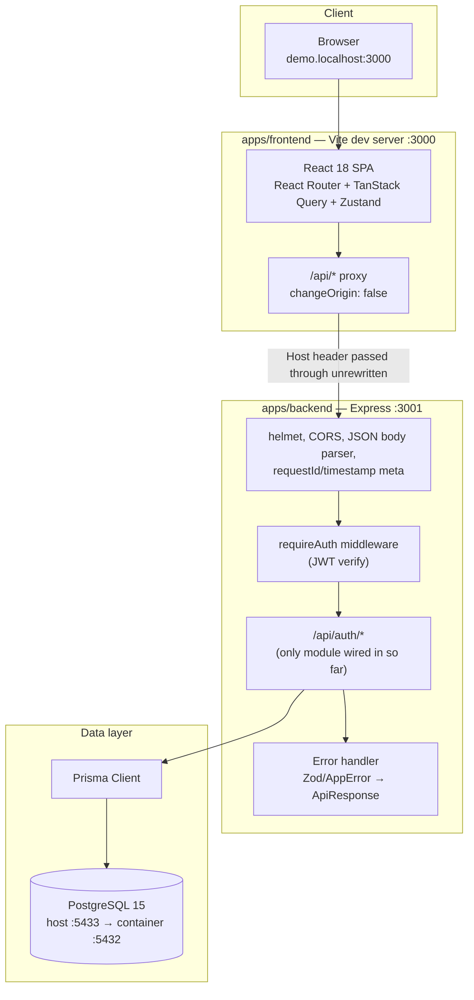
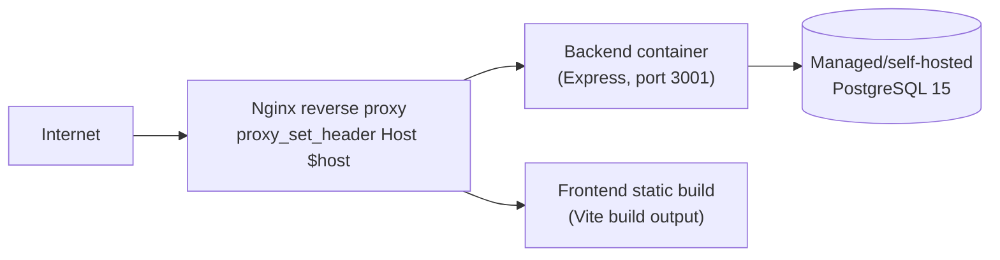

# 04 — System Architecture: SISKOP

Status: written against the codebase as of 2026-07-28 (commit `93e0f1b`). Fills the
`04-System-Architecture-SISKOP.md` gap noted in `SETUP-VERIFICATION.md` "Known gaps". Sections are
marked **Current** (what runs today) or **Target** (documented direction, not yet built).

## 1. High-level overview (Current)



Both apps run from one monorepo via Turborepo + pnpm workspaces (`pnpm run dev` runs both
concurrently: backend on `3001`, frontend on `3000`).

## 2. Monorepo layout (Current)

| Path | Contents |
|---|---|
| `apps/backend` | Express API, Prisma schema + migrations, Vitest tests |
| `apps/frontend` | React + Vite + Tailwind SPA |
| `packages/types` | `@siskop/types` — shared `ApiResponse`/`ErrorCode`, domain types (`Tenant`, `User`, `Member`, `CooperativeUnit`), consumed by both apps so a wire-format change is a single-package edit |
| `packages/eslint-config` | Shared ESLint flat config |
| `docs/claude-integration` | Per-role (PM/Engineer/QA/Ops) Claude instructions |
| `docs/` | This document set |

Build orchestration is Turborepo (`turbo.json`): `build`/`typecheck`/`test` depend on `^build`
(a package's dependencies build first — `@siskop/types` before either app); `dev` is
non-cached/persistent; `lint` has no outputs to cache against.

`packages/shared`, named in the original scaffolding plan's file-structure diagram, was never
created and nothing imports it — deliberately deferred (`SETUP-VERIFICATION.md`).

## 3. Backend architecture (Current)

### 3.1 Module layout

Target convention per `docs/claude-integration/ENGINEER-INSTRUCTIONS.md`: one directory per
module under `apps/backend/src/modules/<module>/`, each with `route`, `service`, `repository`,
`schema` files. What actually exists today is smaller than that convention describes:

```
apps/backend/src/
  app.ts                    # createApp(): middleware, route mounting, error handler
  main.ts                   # process entrypoint (listen)
  lib/
    db.ts                   # Prisma client singleton
    errors.ts               # AppError + ErrorCode → HTTP status map
  middleware/
    auth.ts                 # requireAuth, signAccessToken/verifyAccessToken, assertUnitAccess
  modules/
    auth/
      routes.ts             # POST /register, /login, /refresh, GET /me
      service.ts             # business logic: registerTenant, login, refreshSession
      tenant-host.ts         # slugFromHost() — Host header → tenant slug
    tenants/
      provision.ts           # provisionTenant() — lower-level tenant+units creation
```

There is no standalone `repository` layer yet — `service.ts` calls the Prisma client
(`lib/db.ts`) directly. No module beyond `auth`/`tenants` exists; Members, Savings, Loans,
Reports, Config, and Platform Admin have no `modules/<name>/` directory at all yet (their data
models exist in `prisma/schema.prisma` — see `docs/05-DB-Schema-SISKOP.md`).

### 3.2 Request lifecycle

1. `helmet()` — security headers.
2. `cors()` — origin allow-list from `CORS_ORIGIN` env var, credentials enabled.
3. `express.json({ limit: "1mb" })`.
4. A meta middleware stamps `res.locals.meta = { timestamp, requestId }` — one ID per request,
   shared by both the success and error response paths, so a client-reported request ID matches
   exactly one server log line.
5. Route match. Protected routes run `requireAuth` first, which verifies the JWT and attaches
   `req.auth: AuthClaims` (`userId`, `tenantId`, `role`, `unitIds`).
6. Route handler validates the body with Zod, calls into `service.ts`, wraps the result in
   `{ success: true, data, meta }`.
7. Errors funnel to a single error-handling middleware: `ZodError` → 422 `VALIDATION_ERROR` with
   field-level issues; `AppError` → its mapped status/code; anything else → logged server-side,
   returned to the client as an opaque 500 `INTERNAL_ERROR` (internals are never leaked by
   default).

### 3.3 Error model

`lib/errors.ts::AppError` is the only error type a route may throw and have its message reach the
client. `ErrorCode` (`packages/types/src/api.ts`) maps 1:1 to HTTP status:

| Code | Status |
|---|---|
| `UNAUTHORIZED` | 401 |
| `FORBIDDEN` | 403 |
| `NOT_FOUND` | 404 |
| `VALIDATION_ERROR` | 422 |
| `CONFLICT` | 409 |
| `RATE_LIMIT` | 429 (defined, unused — no rate limiting implemented yet) |
| `INTERNAL_ERROR` | 500 |

### 3.4 Logging

`pino`/`pino-http` are dependencies but not yet wired into `app.ts` (which currently uses
`console.error` for uncaught errors). Structured request logging is a gap, not a design choice.

## 4. Frontend architecture (Current)

| Concern | Choice | Notes |
|---|---|---|
| Framework | React 18 + Vite 5 + TypeScript | `apps/frontend` |
| Routing | React Router 6 | `App.tsx` — `/login` (public), `/` (behind `RequireAuth`), catch-all → `/` |
| Server state | TanStack Query 5 | Not yet used beyond the health-check fetch in `HomePage.tsx` |
| Client/auth state | Zustand | `stores/auth.ts` — `accessToken`/`user` persisted to `localStorage`, seeded on load so a page refresh doesn't bounce the user to `/login` |
| Styling | Tailwind CSS 3 | `tailwind.config.js`, `index.css` |
| Icons | `lucide-react` | |
| API client | Hand-written `apiFetch<T>()` | `api/client.ts` — prefixes every call with `/api`, attaches the bearer token, unwraps `ApiResponse<T>`, throws `ApiRequestError` on `!success` |

`RequireAuth` in `App.tsx` gates on presence of an access token only — it does not itself check
tenant scope, because the token is already tenant-scoped server-side; a token that targets the
wrong tenant's subdomain simply fails every subsequent request, not at the route guard.

Pages implemented: `LoginPage` (form → `POST /api/auth/login` → `setSession`), `HomePage`
(renders backend health status — a placeholder, not the Dashboard module).

There is no frontend test setup (no Vitest/RTL, no `test` script) — `turbo run test` covers the
backend only. The one browser-driven verification on record
(`SETUP-VERIFICATION.md`) was done manually via headless Chrome, not an automated suite.

## 5. Multi-tenancy architecture (Current) — the load-bearing design decision

This is the single rule the rest of the system is built to protect (`CLAUDE.md` rule 1):

> Every Prisma query touching tenant data MUST filter by `tenantId` taken from
> `req.auth.tenantId`. Never from the request body or a URL param.

Two distinct mechanisms enforce it at two different points in the request lifecycle:

1. **Post-login, every request**: `tenantId` comes from the verified JWT (`req.auth.tenantId`,
   set by `requireAuth`). A client cannot influence this value — it isn't read from the body, a
   header, or a query param.
2. **At login, before `req.auth` exists**: the tenant is resolved from the `Host` header via
   `slugFromHost()`, not from a field in the login form. This closes an otherwise-open door: if
   login accepted a tenant identifier in the request body, any caller could attempt credentials
   against any tenant by simply naming it.

That second mechanism has a specific, easy-to-break dependency: the Vite dev proxy's
`changeOrigin` **must** stay `false` (`apps/frontend/vite.config.ts`). Setting it `true` rewrites
the `Host` header to the proxy target (`localhost:3001`) before the backend ever sees the original
`demo.localhost:3000`, silently erasing the subdomain and making every login fail closed with
"cooperative not identified." The equivalent production requirement is
`proxy_set_header Host $host;` on the Nginx reverse proxy (Target, see §8) — there is no Nginx
config in this repo yet, so this is a requirement to carry forward when one is written, not
something already verified in production.

`RESERVED` hostnames (`www`, `api`, `admin`, `app`, `static`, `cdn` — `tenant-host.ts`) are
rejected as slugs so a platform-level route can never be shadowed by a tenant registering that
name.

## 6. AuthN / AuthZ (Current)

- **Password storage**: bcrypt, 10 rounds (`BCRYPT_ROUNDS`).
- **Session**: short-lived access JWT (15m default) + longer-lived refresh JWT (7d default), both
  signed with separate secrets (`JWT_SECRET`, `JWT_REFRESH_SECRET`) that must be set — there is no
  fallback default, so a misconfigured deployment fails loudly instead of signing with `""`.
- **Access claims** (`AuthClaims`): `userId`, `tenantId`, `role`, `unitIds`. `unitIds` is
  recomputed on every login/refresh from current `UnitMembership` (for `member`) or all active
  units (for staff roles) — never trusted as a long-lived cache.
- **Refresh claims**: identity only (`userId`, `tenantId`, `typ: "refresh"`) — role and units are
  re-derived at refresh time so a permission change lands within one access-token lifetime (≤15m)
  rather than persisting for the refresh token's full 7-day validity.
- **Authorization**: role is checked per-route (not yet — no route beyond `auth` exists to check
  it on); unit-scoped access is checked via `assertUnitAccess(claims, unitId)`, currently defined
  but not yet called from any route, since no unit-scoped resource routes exist yet.

## 7. Data layer (Current)

- **ORM**: Prisma 5, PostgreSQL 15.
- **Money**: `Decimal(18,2)` for all balances/amounts (`CLAUDE.md` rule 2) — see
  `docs/05-DB-Schema-SISKOP.md` for the column-by-column reference.
- **Migrations**: `apps/backend/prisma/migrations/` — three applied
  (`20260727082242_init`, `20260727090000_add_cooperative_units`, `20260727093000_add_tenant_slug`).
- **Environments**: `siskop_dev` (local dev, port 5433 host-mapped), `siskop_test` (integration
  tests — truncated between runs, never the dev database), CI's own ephemeral Postgres service
  (port 5432, since CI runners have no conflicting native Postgres).
- **Client lifecycle**: a single Prisma client instance (`lib/db.ts`), imported wherever a query
  is needed — no per-request client, no repository abstraction yet.

## 8. Deployment architecture (Target — not built in this repo)

Baseline per `docs/claude-integration/OPS-INSTRUCTIONS.md`:



- Single VPS, Docker Compose, Nginx reverse proxy, PostgreSQL 15 — this repo currently ships only
  a dev-oriented `docker-compose.yml` (Postgres only, no app containers, no Nginx config).
  Building the production Compose file and Nginx config is Ops-owned, undone work.
- Deploy flow: `develop` → staging automatically; `main`/production ships on a tagged release after
  QA sign-off. No CD workflow exists yet — `.github/workflows/ci.yml` runs verification
  (lint/typecheck/test/build) on push/PR to `main`/`develop`, but does not deploy anywhere.
  See `docs/02-System-Requirements-SISKOP.md` §2.2 for the associated availability requirements
  (RTO/RPO/backups), none of which are implemented yet.
- Scale path: managed Postgres + object storage for report artifacts (for PDF exports once the
  Reports module exists).

## 9. Observability (Target — not built)

There is currently no metrics, tracing, or alerting pipeline. `pino`/`pino-http` are installed but
unused (§3.4). This is a direct gap against the PM/QA targets in
`docs/01-PRD-SISKOP.md` §10 (99.5% uptime, <500ms p99, NPS) — none of those targets can be
measured today.

## 10. CI (Current)

`.github/workflows/ci.yml`, on push to `main`/`develop` and on every PR:

1. Checkout, pnpm 9 + Node 20 setup.
2. `pnpm install --frozen-lockfile`.
3. `prisma generate` for `@siskop/backend`.
4. `pnpm run lint` (all packages).
5. `pnpm run typecheck` (all packages).
6. `prisma migrate deploy` against the CI Postgres service.
7. `pnpm run test` (Vitest + coverage, backend only — frontend has no test script).
8. `pnpm run build` (all packages).

No deploy step exists in this workflow (see §8).

## 11. Open architecture decisions

Carried from `SETUP-VERIFICATION.md`, listed here because they shape how new modules should be
built:

1. `unitIds` in the JWT trades staleness (≤15m) for avoiding a per-request permission lookup. If
   staff start moving between units frequently, swap to a cached per-request lookup — call sites
   of `assertUnitAccess` are written so they would not need to change.
2. The "≥1 unit per tenant" invariant lives in application code (`provisionTenant()`/
   `registerTenant()`), not a database constraint, because Postgres cannot express "at least one
   child row." Any new code path that creates a tenant must go through one of those two functions,
   not construct a `Tenant` row directly.
3. Tenant resolution by subdomain (not a login-form field) is a security boundary, not just UX —
   see §5. Any future "switch cooperative" UI must not reintroduce a client-suppliable tenant
   identifier into the auth flow.

## 12. Related documents

- `docs/01-PRD-SISKOP.md` — product scope this architecture serves
- `docs/02-System-Requirements-SISKOP.md` — the NFRs this architecture is accountable to
- `docs/03-ERD-SISKOP.md` — entity relationships
- `docs/05-DB-Schema-SISKOP.md` — column-level schema, indexes, migrations
- `docs/claude-integration/ENGINEER-INSTRUCTIONS.md`, `OPS-INSTRUCTIONS.md` — role-level ownership
