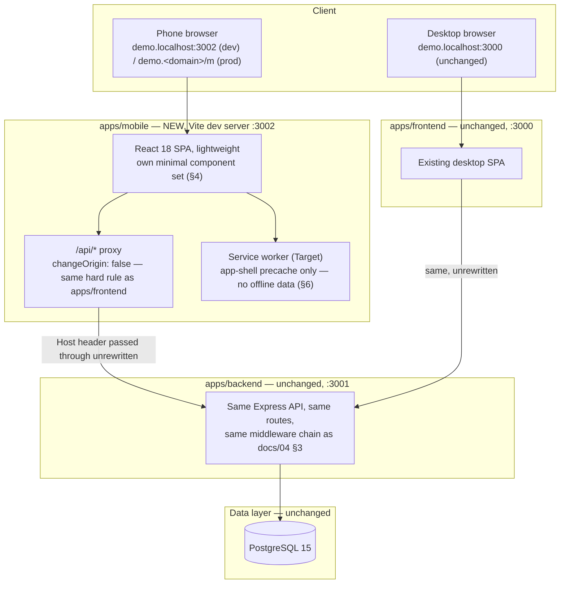

# 07 — System Architecture: SISKOP Mobile Version

Status: living document, first draft **2026-08-12**, written alongside
`docs/06-PRD-SISKOP-Mobile-Version.md`. **This document is additive to
`docs/04-System-Architecture-SISKOP.md`, not a replacement.** Nothing described there (backend
module layout, request lifecycle, multi-tenancy, authN/authZ, data layer) changes for the mobile
initiative — this document states only what's new: a new frontend package and the decisions specific
to serving it. Sections are marked **Target** (not yet built — nothing under `apps/mobile` exists in
the repo as of this writing) since Fase 1 implementation hasn't started; anything marked **Reused
(Current)** points back to `docs/04-System-Architecture-SISKOP.md` unchanged.

## 1. High-level overview (Target)

Two independent frontend packages, one backend, one database. `apps/mobile` is not a variant build of
`apps/frontend` — it is a **separate app** with its own `package.json`, its own component set (§4),
that happens to call the identical backend API.

## 2. Monorepo layout changes (Target)

| Path | Contents | Status |
|---|---|---|
| `apps/mobile` | New Vite + React + Tailwind SPA, read-only screens per `docs/06-PRD-SISKOP-Mobile-Version.md` §6-7 | **To be created** — a prior, uncommitted attempt at this path existed in an earlier session (see repository memory) but is not in `main`; build from scratch |
| `apps/backend` | Unchanged | Reused (Current) — `docs/04-System-Architecture-SISKOP.md` §3 |
| `apps/frontend` | Unchanged | Reused (Current) — `docs/04-System-Architecture-SISKOP.md` §4 |
| `packages/types` | Unchanged — `apps/mobile` imports `@siskop/types` exactly as `apps/frontend` does | Reused (Current) |
| `packages/eslint-config` | Unchanged — `apps/mobile` should use the same shared flat config, not a bespoke one | Reused (Current) |

`turbo.json`'s `build`/`typecheck`/`test`/`lint` pipelines need `apps/mobile` added as a workspace
member once it exists, same dependency ordering as `apps/frontend` (`@siskop/types` builds first via
`^build`, per `docs/04-System-Architecture-SISKOP.md` §2). `.github/workflows/ci.yml` needs the same
addition — until then, CI does not cover `apps/mobile` at all.

## 3. Why a separate app, not a responsive variant of `apps/frontend`

This is a considered decision, not a default:

- `apps/frontend` is desktop-oriented shadcn/ui + Radix + `recharts` + `react-hook-form` — a
  meaningfully heavier bundle than a phone-first app needs.
- The UI-risk inventory (`docs/06-PRD-SISKOP-Mobile-Version.md` §8) found the breakage risk is
  concentrated in *reusing desktop components as-is at a narrower width* (raw tables, unresponsive
  grids) — exactly the failure mode that motivated this whole audit in the first place (a prior,
  unrelated project's web-to-app conversion broke this way). Building phone-first screens fresh,
  rather than squeezing desktop components down, avoids re-creating that failure mode.
- A separate app can defer read-only screens' data needs (§6, §7 below) instead of loading routes,
  permission logic, and components for write flows (Config, Platform Admin, all create/edit dialogs)
  that Fase 1 explicitly excludes (`docs/06-PRD-SISKOP-Mobile-Version.md` §6, §11).

**Trade-off accepted**: some duplication between `apps/frontend` and `apps/mobile` (currency
formatting, date formatting, API client wrapper) rather than a shared UI package. `packages/shared`,
named in the original project scaffolding plan, was already deliberately never created
(`docs/04-System-Architecture-SISKOP.md` §2) — this decision extends that same choice rather than
reversing it. Revisit only if duplicated logic (not UI components) causes real bugs from drift
between the two apps.

## 4. Frontend architecture (Target)

| Concern | Choice | Note |
|---|---|---|
| Framework | React 18 + Vite 5 + TypeScript | Same major versions as `apps/frontend`, for tooling consistency |
| Component kit | **Own minimal set — not shadcn/Radix** | Deliberately lighter: no accordion/dropdown-menu/dialog primitives beyond what read-only screens need. Avoids "port a desktop component and hope it survives" (§3). This is an *implementation* choice only — it does not change the visual result (see "Visual identity" row) |
| **Visual identity** | **Reuse `apps/frontend`'s exact design tokens** — copy the same CSS custom properties (`--primary`, `--secondary`, `--muted`, `--destructive`, `--radius`, etc. from `apps/frontend/src/index.css`) and the same `tailwind.config.js` color/radius extension verbatim, not a new palette | **User-confirmed constraint (2026-08-12)**: the mobile version must stay visually/functionally close to desktop, not read as a different product. Same colors, same Indonesian terminology, same `lucide-react` icons, same data per screen — only layout mechanics (table→card, grid columns) change |
| Styling | Tailwind CSS 3, phone-first (`grid-cols-1` default, widen only at `sm:`/`md:` if ever needed — not the other way around) | Opposite authoring direction from `apps/frontend`'s desktop-first-then-collapse pattern, deliberately, since that pattern is what produced the risk inventory in `docs/06-PRD-SISKOP-Mobile-Version.md` §8 |
| Navigation | **Bottom tab bar** (not a port of `Sidebar.tsx`'s hamburger+drawer) | **User's explicit choice (2026-08-12)**, decided over the lower-risk alternative of reusing the desktop drawer pattern — accepted as the one place the mobile UI's *shape* diverges from desktop, while colors/type/terminology (above) stay identical |
| List/table replacement | A card-list component (new — no equivalent exists to reuse), per `docs/06-PRD-SISKOP-Mobile-Version.md` §8.1 | The single most-reused new component — every list screen (Members, Savings, Loans, Overdue) needs it |
| Charts | Only if Dashboard needs them (FR-MOB-DASH-02) — evaluate a lighter library than `recharts` before adopting it wholesale | Open decision, not yet made |
| Server state | TanStack Query 5 | Same choice as `apps/frontend` — well-suited regardless of app size, no reason to diverge |
| Client/auth state | Zustand, same pattern as `apps/frontend`'s `stores/auth.ts` (access token memory-only, never persisted) | Reused pattern, not reused code |
| API client | New, minimal `apiFetch`-equivalent — same shape as `apps/frontend/src/api/client.ts` (unwrap `ApiResponse<T>`, 401-retry-via-refresh-cookie, `ApiRequestError`) since the backend contract is identical | Port the *behavior*, not the file — keep it small |
| Icons | `lucide-react` (already a small, tree-shakeable dependency) — fine to reuse directly | Low bundle cost, no reason to avoid |

Every screen in scope (`docs/06-PRD-SISKOP-Mobile-Version.md` §7) is view-only: no `react-hook-form`
+ Zod form stack is needed anywhere in Fase 1 (login is the only form, and it's two fields — plain
controlled inputs are enough, no schema-validation library required).

## 5. Reused unchanged from `apps/frontend`/`apps/backend` (Current)

Everything below is identical to `docs/04-System-Architecture-SISKOP.md` and requires zero backend
code changes — only pointed to here so this document doesn't re-explain it:

- **Multi-tenancy** (§5 there): subdomain-resolved tenant at login, JWT-carried `tenantId`
  thereafter. `apps/mobile`'s dev proxy **must** set `changeOrigin: false`, identically to
  `apps/frontend/vite.config.ts` — this is a new file making the same security-relevant choice, not
  an inherited one, so it needs to be set correctly independently.
- **AuthN/AuthZ** (§6 there): bearer access token + httpOnly refresh cookie, same 3+1 authorization
  axes. A read-only mobile client naturally exercises only the "read" action of
  `requirePermission(module, action)` — no new permission model needed.
- **API contract**: `ApiResponse<T>`, `ErrorCode` enum, Zod-validated request bodies — `apps/mobile`
  is just another consumer.
- **Data layer**: no schema changes; `apps/mobile` never talks to Postgres directly.

## 6. PWA architecture (Target)

Per `docs/06-PRD-SISKOP-Mobile-Version.md` NFR-MOB-PWA-01/NFR-MOB-OFFLINE-01:

- **Web app manifest** (`apps/mobile/public/manifest.json` or Vite-plugin-generated): name, icons
  (multiple sizes), `theme-color`, `display: "standalone"` — enables "Add to Home Screen".
- **Service worker**: precache the app shell (JS/CSS/static assets) only — **not** API responses.
  This gives fast repeat-load and installability without building an offline data-sync story, which
  `docs/06-PRD-SISKOP-Mobile-Version.md` NFR-MOB-OFFLINE-01 explicitly excludes from Fase 1. A
  standard tool (e.g. `vite-plugin-pwa`/Workbox in "precache app shell, network-first for everything
  else" mode) is enough — no custom sync/queue logic.
- **Viewport/safe-area**: `apps/mobile/index.html` needs `viewport-fit=cover` plus CSS
  `env(safe-area-inset-*)` handling for notched devices — `apps/frontend/index.html` has neither
  today (confirmed during the UI audit), so this is new work, not a copy.
- Explicitly **not** in scope for Fase 1: background sync, push notifications (the backend's
  `Notification`/`NotificationRead` schema exists but nothing produces/consumes it yet — unrelated to
  this initiative), IndexedDB-backed offline reads.

## 7. Serving/deployment architecture (Target — open decision)

`docs/04-System-Architecture-SISKOP.md` §8 documents the (not-yet-built) production shape: Nginx →
backend container + static frontend build. Adding a second static frontend raises a question that
document doesn't answer yet, because it didn't need to:

**How does a phone reach the mobile build without breaking subdomain-based tenant resolution?**
Tenant identity comes from the first label of the `Host` header (`demo.<domain>` →
slug `demo`) — this must keep working unchanged (`CLAUDE.md` rule 1).

| Option | How it works | Backend impact | Recommendation |
|---|---|---|---|
| **Path-based** (`demo.<domain>/m/*`) | Nginx serves the mobile build under a path prefix on the *same* subdomain as desktop | None — `Host` header is untouched, tenant resolution is identical | **Recommended** — zero backend/tenant-resolution risk, matches the PRD's "no backend changes" goal |
| Subdomain-prefix (`m.demo.<domain>`) | A second-level subdomain in front of the tenant slug | `slugFromHost()` would need to parse and strip an `m.` prefix before extracting the tenant slug — an actual backend logic change | Not recommended without a deliberate backend change and its own test coverage |
| User-agent sniffing + auto-redirect from `/` | Server or edge detects a phone UA and redirects to the mobile build | None, if layered on top of the path-based option | Optional nicety, not required for Fase 1 — explicit `/m` URLs are simpler to test and don't risk misdetecting a desktop browser in phone-emulation mode during QA |

This is flagged as **open** (also listed in `docs/06-PRD-SISKOP-Mobile-Version.md` §12) — the
path-based approach is this document's recommendation, not yet a confirmed decision, since it also
depends on how the (still entirely undocumented, `docs/04-System-Architecture-SISKOP.md` §8 marks it
"Target — not built in this repo") production Nginx config ends up structured.

**Local dev** is a separate, already-precedented concern (per repository memory from a prior session):
run `apps/mobile` on its own Vite dev server port (**3002**, following backend `3001`/frontend `3000`)
with `allowedHosts` including both `.localhost` and `.nip.io`, so `demo.<lan-ip>.nip.io:3002` can be
used to test from a real phone on the same LAN while still preserving subdomain-based tenant
resolution — the same trick used before, safe to reapply.

**CORS**: `apps/backend`'s `CORS_ORIGIN` allow-list (`docs/04-System-Architecture-SISKOP.md` §3.2)
needs the new dev origin (`http://demo.localhost:3002`, `http://*.nip.io:3002`) and eventual
production origin added. This is an **env/config change, not a code change** — worth being precise
that it doesn't contradict the PRD's "no backend changes" framing, which refers to route/schema/logic
changes.

## 8. Component architecture for the UI-risk fixes

Maps `docs/06-PRD-SISKOP-Mobile-Version.md` §8.1's systemic patterns onto concrete `apps/mobile`
components (all new — nothing here is a port of an `apps/frontend` component):

| Desktop risk (docs/06 §8.1) | `apps/mobile` component | Design constraint |
|---|---|---|
| `DataTable`'s raw `<table>`, no card fallback | `CardList<T>` (new) | Phone-first from the start — never authored as a table that gets squeezed |
| Missing `overflow-x-auto` on ledger tables | Ledger rows rendered as stacked cards (date/type/amount/note), not a table at all | Avoids the table-overflow problem by not using a table for this data shape on mobile |
| Unresponsive `grid-cols-2`/`grid-cols-3` | Single-column stat/detail layouts by default; multi-column only behind an explicit `sm:`/`md:` breakpoint, never the bare default | Inverts the authoring direction described in §4 |
| PDF Blob+`<a download>` fragility | A dedicated `downloadOrSharePdf()` helper — open new tab as the default, `navigator.share` as a progressive enhancement where available | Needs real-device verification before FR-MOB-RPT-02 is done (`docs/06-PRD-SISKOP-Mobile-Version.md` §8.4) |
| `formatRupiah()` long-form used everywhere | `formatRupiahSingkat()`-equivalent as the **default** in cards/lists, long form only in true detail views | Directly addresses the repeated overflow lesson already captured in repository memory ("Study before UI build") |

## 9. Testing/QA approach (Target)

- No frontend automated test suite exists for `apps/frontend` either (`docs/04-System-Architecture-SISKOP.md`
  §4) — `apps/mobile` inherits the same gap, not a regression specific to this initiative.
- Per `docs/06-PRD-SISKOP-Mobile-Version.md` NFR-MOB-TEST-01: **real-device verification is
  required**, not optional, before any screen in scope is considered done — motivated directly by the
  prior-project incident that prompted this whole audit. Browser dev-tools width resize is a useful
  first pass, not a substitute.
- Cross-tenant data isolation tests are a backend concern (`docs/02-System-Requirements-SISKOP.md`
  NFR-TENANT-02) and are already covered by the existing backend test suite — `apps/mobile` adds no
  new backend routes, so no new isolation-test surface exists unless that changes later.

## 10. Open architecture decisions

**Resolved 2026-08-12:**

1. ~~Serving/routing strategy (§7)~~ — **path-based confirmed** (production still pending an actual
   Nginx config, per `docs/04-System-Architecture-SISKOP.md` §8, so nothing to wire up yet for local
   dev — dev runs on its own port per §7).
2. ~~Manifest/icon asset production~~ — **placeholder icon set confirmed**, derived from the existing
   `Building2`-in-primary-square mark (`Sidebar.tsx`); not blocking, replace later with real design
   assets.
3. ~~Testing strategy~~ — **no automated test suite for Fase 1**, matching `apps/frontend`'s
   precedent; real-device verification (§9) remains mandatory per screen.
4. ~~Navigation pattern~~ — **bottom tab bar**, user's explicit choice (§4).
5. ~~Visual identity~~ — **reuse `apps/frontend`'s design tokens exactly** (§4) — not a fresh palette.
6. ~~Chart library for Dashboard~~ — **`recharts`, same as desktop** (not a lighter alternative):
   decided 2026-08-12 once FR-MOB-DASH-02 became a committed requirement (not deferrable) under the
   full-feature-parity principle (`docs/06-PRD-SISKOP-Mobile-Version.md` §6/§12) — reusing the exact
   library keeps chart rendering/behavior identical to desktop, consistent with the visual-identity
   decision (item 5). Built and verified at 375px (`DashboardPage.tsx`): both charts (BarChart/
   LineChart) render legibly with short-form Rupiah axis ticks; tooltip-on-tap confirmed reachable in
   headless/touch-emulated testing, full real-device confirmation still pending per §9.
7. ~~Rekomendasi AI card~~ — **ported verbatim** (`lib/aiSuggestions.ts`, pure rule-based function, no
   new API/LLM dependency) — built same session as item 6, since both were added to Dashboard's scope
   together under the parity principle.

**Still open:**

8. **PDF mechanism (§8)** — new-tab vs. Web Share API vs. something else; needs device testing, not
   a desk decision.
9. **Fase 2 native/auth redesign** — out of this document's scope entirely; see
   `docs/06-PRD-SISKOP-Mobile-Version.md` §4 if that phase is ever greenlit.

## 11. Related documents

- `docs/06-PRD-SISKOP-Mobile-Version.md` — product scope this architecture serves
- `docs/04-System-Architecture-SISKOP.md` — parent architecture (backend, multi-tenancy, authN/authZ,
  data layer — all reused unchanged, §5 above)
- `docs/01-PRD-SISKOP.md` — parent product scope
- `CLAUDE.md` — non-negotiable rules that bind this document exactly as they bind the desktop app
