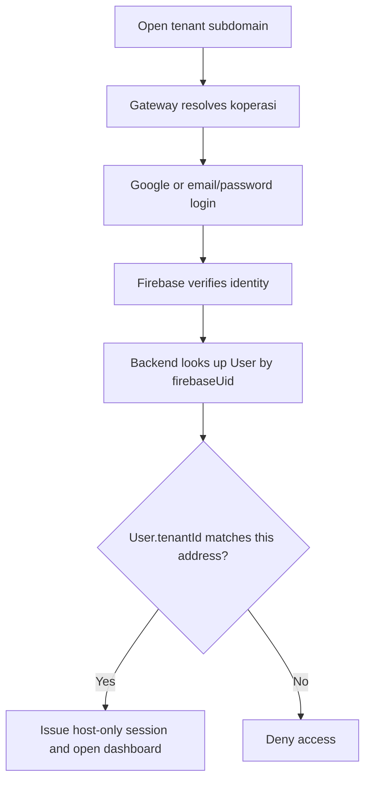

# Tenant addresses and account access

Tenant namespace: `koperasi.inovasijayakarsa.id`.

Each koperasi has one permanent `Tenant.id`. Users, members, transactions and
roles belong to that ID. The `slug` is its editable address, for example
`lini-usaha.koperasi.inovasijayakarsa.id`. A user is a person who signs in;
the user is not the tenant. Changing an address never changes the tenant ID.

## Login and registration



Users do not enter a slug on the Firebase login form. The hostname selects the
koperasi, while the verified Firebase UID selects the person. Every authenticated
API request and refresh must agree with that koperasi. Platform administrators
use the central site. Legacy staff passwords and the separate member portal
remain supported, with the same hostname checks.

Registration, Xendit checkout, payment callbacks and registration recovery stay
at `https://siskop-d0f8c.web.app`. Once routing is activated, registration generates
a lowercase address from the koperasi name plus a random suffix. An unpaid
koperasi cannot use its tenant site. Only verified payment activates it and
returns its canonical tenant login URL. New Resend confirmations use that URL;
an email payload already queued remains unchanged for reliable retries.

## Package policy

- `SubscriptionPackage.customSubdomainEnabled` is an explicit capability; names
  such as “Premium” have no special meaning in code. Existing packages default
  to false until a platform administrator edits them.
- Package upgrades remain managed by the platform administrator through the
  existing package assignment workflow. There is no new upgrade checkout.
- An active koperasi with an eligible, unexpired package can change its address
  through **Konfigurasi → Alamat Workspace**. A null billing date follows the
  existing platform-managed assignment behavior and has no expiry.
- The caller needs `config.update` and a fresh Firebase login for their own UID.
  One successful change is allowed every **365 elapsed days**, including across
  package renewals. Failures and saving the same name do not consume allowance.
- Downgrading or expiry disables further changes but retains the current address.
- Old names remain reserved for the same tenant and redirect to its current
  address. Other tenants cannot claim them. The reservation belongs to the
  tenant for its lifetime; deleting that tenant also removes its reservations.
- There is no administrative cooldown bypass in this implementation.

## Module boundaries

| Location | Responsibility |
| --- | --- |
| `apps/backend/src/modules/tenant-domains/policy.ts` | Pure hostname, reserved-name and cooldown rules |
| `tenant-domains/service.ts` | Use cases; depends on repository, identity-verifier and clock interfaces |
| `tenant-domains/repository.ts` | Prisma adapter, scoped lookups, row locks and atomic history/reservations |
| `tenant-domains/gateway.ts`, `middleware.ts` | Signed host verification and request tenant enforcement |
| `tenant-domains/routes.ts` | Typed HTTP validation and permission checks |
| `apps/frontend/src/features/workspace-domain/` | Tenant context, alias redirects and address settings |
| `apps/backend/src/modules/identity-provisioning/` | Firebase creation adapter and durable recovery ledger |
| `infra/tenant-web/` | Shared frontend server, API proxy and deployment tooling |
| `packages/types/src/tenant-domain.ts` | Shared API contracts |

The existing authentication, onboarding, configuration and package modules call
these boundaries. No koperasi receives a separate frontend build or database.
The Node gateway serves the existing Vite app through Firebase App Hosting and
streams API/uploads to a fixed Cloud Run candidate revision. It strips supplied
assertion headers, signs method/path/host/time and preserves host-only cookies.
The API verifies the signature and browser origin; raw forwarded headers cannot
select a tenant. API responses are private and not cached. Old aliases reject API
writes and direct users to their canonical login.

Migrations are additive: package capability, timestamp, reservation/history
tables, existing slug backfill and an identity provisioning ledger. A database
trigger reserves new slugs even when an older API revision creates a tenant.
Rename operations lock the tenant and atomically update reservations, slug,
timestamp and history. Firebase network calls happen outside these transactions.

## Staff and administrator identities

With `FIREBASE_ACCOUNT_PROVISIONING_ENABLED=true`, staff creation and platform
creation of admins/koperasi owners first record a generated Firebase UID in
`IdentityProvisioning`, then create that identity through Firebase Admin. The
application user and the LINKED ledger state commit in one locked transaction.
PostgreSQL stores `firebaseUid`, `authProvider`, and a null `passwordHash`.
Passwords are passed to Firebase only and never written to the ledger.

An existing Firebase email is not adopted automatically. An operator must verify
ownership before linking an existing account. Existing database-only accounts
are not silently migrated by this feature. Firebase-backed admin email edits
are rejected until an explicit identity-update workflow is implemented.

Recovery is an operator command, not a scheduled task. Run it with the API's
database/Firebase environment and runtime identity after investigating failed
creation attempts:

```sh
node apps/backend/dist/modules/identity-provisioning/reconcile.js
```

It processes at most 100 operations per invocation. After 15 minutes without an
update, PENDING, CLEANUP_REQUIRED and interrupted REMOVING entries are checked.
Linked application users are retained; only abandoned UIDs owned by this ledger
are removed. A late creator cannot commit after recovery claims its operation.
Provider cleanup failures stay retryable. No password is needed for recovery.
The runtime's custom IAM role grants Firebase user create/get/delete only.

## Local verification

Use a dedicated PostgreSQL instance at `127.0.0.1:55433` with the synthetic
`postgres` / `local-test-only` credentials. Do not use the developer database or
Cloud SQL for integration tests: they delete tenant rows. Create separate
databases `siskop_landing_test` and `siskop_tenant_preview` in that local instance.

From the repository root, with dependencies installed and Prisma generated:

```sh
bash infra/tenant-web/verify-local.sh
python3.11 -m unittest discover -s infra/firebase/tests
```

For a browser preview, run these in separate terminals:

```sh
firebase emulators:start --only auth --project demo-siskop-tenants --config infra/tenant-web/emulators.json
bash infra/tenant-web/preview-api.sh
node infra/tenant-web/preview.mjs
```

The preview uses ports 9109 (Firebase Auth), 3051 (API) and 3050 (gateway/Vite).
It explicitly blanks Xendit and Resend credentials. Its seed refuses other
database names, hosts or Firebase projects. Production rejects Firebase Auth
emulator configuration.

Open `http://alpha-preview.koperasi.localhost:3050/login` or
`http://beta-preview.koperasi.localhost:3050/login`. Fixture accounts are
`alpha@tenant-preview.test` and `beta@tenant-preview.test`, password
`Preview-only-123`. They are synthetic emulator accounts. A rename is persisted
in the preview database; the initial URL then redirects to the renamed address.

Check matching login, wrong-tenant denial, dashboard reload, a fresh-auth rename,
annual cooldown/history, old alias redirection and unknown-tenant rejection.
An emulator Google flow does not replace a real hosted Google sign-in test.

## Deployment and activation

The central Firebase Hosting site and the tenant Firebase App Hosting backend
are distinct entry points. Backend `siskop-tenants` is in `asia-southeast1`;
the existing API/Cloud SQL remain in `asia-southeast2`.

1. Use [the DNS record sheet](tenant-domain-dns.md) to configure the wildcard in
   Vercel. Verify current Firebase domain state with
   `node infra/tenant-web/domain-setup.mjs status`. All three states must be
   HOST_ACTIVE, OWNERSHIP_ACTIVE and CERT_ACTIVE.
2. `node infra/tenant-web/setup-access.mjs` configures the server-only gateway
   secret, limited Firebase account permissions, Cloud Build deployment access
   and the authorized Firebase Auth namespace. It also prepares a private source
   bucket with 30-day object retention, gives CI upload access and the App Hosting
   service agent read access on that bucket. CI can list buckets but does not
   receive permission to create them. This was run on 14 September 2026.
   It uses the explicitly selected project/account and never prints the key.
3. Review and merge the feature through the normal PR process. The default
   `_TENANT_HOSTING=false` and `_TENANT_RENAME_ENABLED=false` allow the additive
   migration and code rollout without redirecting customers to unready hosts.
4. After DNS/HTTPS are ready, run the coordinated main release with
   `_TENANT_HOSTING=true`, `_TENANT_RENAME_ENABLED=false` and an existing active
   `_TENANT_SMOKE_SLUG`. This first enablement changes new paid-registration
   destinations to tenant login, so perform it during the validation window.
5. Validate two existing active koperasi on HTTPS: both authentication providers,
   independent cookies after reload, denied cross-tenant login/API/refresh,
   member access, central platform access, and a sandbox payment-to-login flow.
   Verify the wildcard release marker matches the central release. No real
   hosted Google test has been completed by the local emulator tests.
6. Grant the capability to the intended package in the platform UI. Enable
   `_TENANT_RENAME_ENABLED=true` in a coordinated main release after the hosted
   checks pass. Validate one authorized change, its alias and annual allowance.
   Retain these substitutions on the main trigger for subsequent releases.

See [the verification record](tenant-domain-verification.md) for completed checks
and the outstanding hosted checks.

The release lock serializes publishing. Cloud Build tests the source, builds an
immutable API image, runs migrations, and deploys a candidate API. Tenant
publishing uses the exact same workspace and pins its gateway to the candidate
URL. After the App Hosting rollout succeeds, it publishes the central frontend
so registration redirects have a ready destination. It then verifies both
release markers and a real tenant lookup, then promotes the API default traffic.
There is no independent App Hosting push-to-main trigger. Publication uploads an
allowlisted archive containing the already-built frontend, Node gateway and
dependency-free runtime manifest to the prepared bucket. It then creates and
waits for the App Hosting build and rollout through its API. This reuses the
exact frontend artifact from CI and avoids a second monorepo dependency install.
Routine releases never create
service accounts or change project IAM. Firebase CLI 15.12.0 performs that setup
on every `firebase deploy --only apphosting` invocation, so it is not used by CI.

Publishing across two hosting products is not atomic. If a tenant rollout fails,
the build stops before central Hosting publishes and does not promote default
API traffic or release its lock. If central publication or final verification
then fails, tenant hosting may already serve the new candidate while the central
site still serves its previous version.
Inspect both release markers and retry from current main. A later build can
reclaim the lock only once Cloud Build reports the earlier build terminal and
its tenant rollout has settled (or no tenant rollout was created).

Do not deploy `apphosting.yaml` directly: its API placeholder is deliberately
replaced only by the release coordinator. Keep generated release state out of
Git. `TENANT_GATEWAY_SECRET` is a runtime Secret Manager binding, never a Vite
variable. Its API binding is pinned to version 1; rotation must update both
gateway and API in a coordinated rollout.

For rollback, disable new renames first. Restore the known-compatible API and
both frontend releases together; retain the additive tables and reservation
trigger so old names remain protected. Once customers use tenant addresses,
keep tenant routing available while diagnosing a failed deployment. Disabling
all routing makes those addresses unavailable and is an emergency measure.
